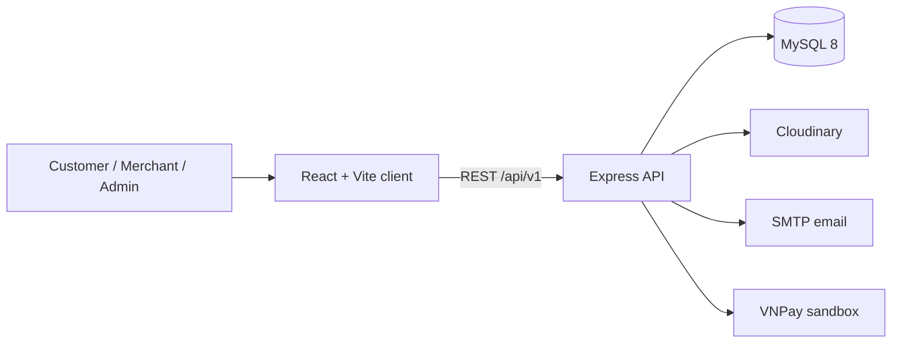

# NomNom — Nền tảng đặt và giao đồ ăn ba vai trò

NomNom là nền tảng đặt món gồm Khách hàng, Nhà hàng và Admin, với giao diện hiện đại và
quy trình đơn hàng có kiểm soát. Nhà hàng tự giao hoặc thuê đơn vị vận chuyển bên ngoài NomNom.

## Academic Project

NomNom is a graduation project developed at **FPT Polytechnic** by a six-member student team.

| Team member | Role |
|---|---|
| **Nguyễn Công Ben** | Team Leader |
| Hồ Minh Nhật | Team Member |
| Nguyễn Văn Dĩ Khang | Team Member |
| Ong Tuấn Nghĩa | Team Member |
| Trần Minh Được | Team Member |
| Nguyễn Thị Như Ngọc | Team Member |

> [!NOTE]
> This repository is an educational graduation project. It is suitable for learning, evaluation, and local demonstrations, but it has not yet completed a production security or reliability audit.

## Features

### Customer

- Email registration, OTP verification, JWT authentication, and profile management
- Restaurant discovery, search, menu browsing, addresses, and persistent carts
- COD and VNPay checkout, server-validated vouchers, order history, live status polling, reorder, and restaurant reviews

### Merchant

- Restaurant onboarding and approval workflow
- KPI dashboard, order board, and order status transitions
- Menu category and item management with image uploads
- Restaurant-scoped promotion management and public review replies
- Wallet, payout requests, restaurant settings, notification inbox, and order-context chat

### Administration

- User administration and merchant application approval
- Platform overview with operational metrics
- Global order audit/refund operations and review moderation
- Merchant payout review, financial reporting, platform configuration, notifications, and support chat

## Project Status

| Area | Status |
|---|---|
| Waves 1-3: discovery, COD ordering, merchant operations | Complete |
| Wave 4: VNPay, vouchers, merchant promotions, moderation | Implementation complete; sandbox acceptance pending credentials |
| Wave 5: merchant finance, configuration, notifications, and chat | Complete and locally verified |
| Final three-role scope and delivery flow | Complete and locally verified |

See [completed-wave documentation](./docs/README.md), the [Wave 4 report](./docs/wave-4-completed.md), and the [Wave 5 report](./docs/wave-5-completed.md) for verified scope and remaining acceptance checks.

## Repository Structure

Monorepo: React client + Express API + MySQL.

```
nomnom/
├── client/          # React/Vite frontend
├── server/          # Express API (see server/README.md)
├── database/        # Schema + seed (nomnom.sql)
└── docs/            # Project documentation (see docs/README.md)
```

| Path | Description |
|------|-------------|
| [client/](./client) | Customer, Merchant, and Admin UI |
| [server/](./server) | REST API, auth, uploads, admin |
| [database/](./database) | MySQL schema and seed data |
| [docs/](./docs) | Auth guide, planning waves, ERD, use cases |

## Tech Stack

- **Frontend**: React 19, Vite, Tailwind CSS, React Router, Context API
- **Backend**: Node.js, Express, MySQL 8, JWT, Cloudinary
- **Integrations**: Nodemailer, Cloudinary, Railway, Vercel, and VNPay sandbox
- **Product language**: Vietnamese

## Architecture



The application is a monorepo with role-oriented frontend modules and a single REST API. MySQL stores identity, catalog, cart, order, review, and financial records. See the [project overview](./docs/analysis/project-overview.md), [ERD](./docs/analysis/erd.md), and [use cases](./docs/analysis/usecase.md).

## Prerequisites

- Node.js 18 or newer
- npm 9 or newer
- MySQL 8
- Optional: Cloudinary account for uploads and SMTP credentials for real email delivery

## Quick Start

### 1. Clone and install

```bash
git clone https://github.com/nguywnben/nomnom.git
cd nomnom
cd server && npm ci
cd ../client && npm ci
cd ..
```

### 2. Create the database

```bash
mysql -u root -p -e "CREATE DATABASE IF NOT EXISTS nomnom"
mysql -u root -p nomnom < database/nomnom.sql
```

For a fresh Waves 4-5 environment, import the base file and then apply the migrations in order:

```bash
mysql -u root -p nomnom < database/migrations/20260711_wave4_foundation.sql
mysql -u root -p nomnom < database/migrations/20260803_wave4_completion.sql
mysql -u root -p nomnom < database/migrations/20260804_wave5_completion.sql
```

The API also performs idempotent startup checks for the Wave 4-5 additions, checkout idempotency,
and upload ownership. Review [database migrations](./database/migrations/) before applying migrations to an existing shared database.

### 3. Configure and run the API

```bash
cd server
cp .env.example .env
# Update database settings and replace JWT_SECRET.
npm run dev
```

The API starts at `http://localhost:3000`; `GET /api/health` returns the health status.

### 4. Configure and run the client

```bash
cd client
cp .env.example .env
npm run dev
```

Open `http://localhost:5173`.

## Environment Variables

Copy the committed example files; never commit real `.env` files.

### Server

| Variable | Required | Purpose |
|---|---|---|
| `PORT` | No | API port; defaults to `3000` |
| `MYSQL_URL` | Alternative | Full MySQL connection URL, recommended on Railway |
| `DB_HOST`, `DB_PORT`, `DB_USER`, `DB_PASSWORD`, `DB_NAME` | Yes locally | Individual MySQL connection settings |
| `CORS_ORIGIN` | Yes | Allowed frontend origin |
| `JWT_SECRET` | Yes | JWT signing secret; replace the example value |
| `JWT_ACCESS_TTL`, `JWT_REFRESH_DAYS` | No | Token lifetimes |
| `CLOUDINARY_*` | For uploads | Cloudinary credentials |
| `SMTP_*` | For real email | SMTP transport; development logs OTP when omitted |
| `VNPAY_TMN_CODE`, `VNPAY_HASH_SECRET` | For VNPay | Sandbox merchant credentials; never commit them |
| `ORDER_EXPIRY_BATCH_SIZE` | No | Worker batch size, defaults to 100 and caps at 500 |

### Client

| Variable | Required | Purpose |
|---|---|---|
| `VITE_API_URL` | No locally | API origin; empty uses the Vite `/api` proxy |

See [server/.env.example](./server/.env.example), [client/.env.example](./client/.env.example), and the [authentication guide](./docs/AUTH.md).

## Available Commands

Run commands from the relevant package directory.

| Package | Command | Description |
|---|---|---|
| Client | `npm run dev` | Start the Vite development server |
| Client | `npm run build` | Create a production build |
| Client | `npm run lint` | Run ESLint |
| Client | `npm test` | Run focused Node regression tests |
| Client | `npm run preview` | Preview the production build |
| Server | `npm run dev` | Start the API with Node watch mode |
| Server | `npm start` | Start the API without watch mode |
| Server | `npm test` | Run VNPay and voucher regression tests |

## Demo Accounts

After importing `database/nomnom.sql`, all documented demo accounts use the password `password123`.

| Role | Email | Entry point |
|---|---|---|
| Admin | `avery@nomnom.example` | `/admin` |
| Customer | `mara@example.com` | `/app` |
| Merchant | `owner@cinque.example` | `/merchant` |

No permanent public demo URL is guaranteed yet. Local setup is the supported demonstration path.

## Testing and Quality Checks

Run the full local quality gate before opening a pull request:

```bash
cd client
npm test
npm run lint
npm run build

cd ../server
npm test
Get-ChildItem src -Recurse -Filter *.js | ForEach-Object { node --check $_.FullName }
```

Regression tests cover checkout validation/idempotency, order transitions, VNPay signatures/refund
contracts, vouchers, payout, security limits and upload ownership. Also smoke-test all three authenticated
role flows. Live VNPay payment and refund checks require sandbox credentials.

## API and Project Documentation

- [Server endpoints](./server/README.md)
- [Authentication and seed users](./docs/AUTH.md)
- [Project documentation index](./docs/README.md)
- [Wave 4 completion report](./docs/wave-4-completed.md)
- [ERD and database design](./docs/analysis/erd.md)
- [Use-case analysis](./docs/analysis/usecase.md)
- [Railway deployment](./docs/RAILWAY.md)

## Deployment

- The React client includes SPA rewrites for Vercel in [client/vercel.json](./client/vercel.json).
- The Express API and MySQL deployment process is documented for Railway in [docs/RAILWAY.md](./docs/RAILWAY.md).
- Production deployments must use unique secrets, HTTPS, a restricted `CORS_ORIGIN`, and non-demo accounts.

## Roadmap

- Browser E2E and broader concurrency/load coverage
- Post-defense contract migration for unused legacy driver schema
- Production security, reliability, observability, and deployment hardening

Detailed planning lives in [docs/planning](./docs/planning/) and [tasks](./tasks/).

## Contributing

Contributions are welcome for educational and project-improvement purposes. Read [CONTRIBUTING.md](./CONTRIBUTING.md), follow the [Code of Conduct](./CODE_OF_CONDUCT.md), and use the pull request template.

## Security

Do not open public issues for vulnerabilities or include secrets, personal data, or production credentials in reports. Follow [SECURITY.md](./SECURITY.md) for private reporting instructions.

## License

This project is available under the [MIT License](./LICENSE).

## Acknowledgements

NomNom uses or integrates with React, Vite, Tailwind CSS, Express, MySQL, Cloudinary, Nodemailer, Leaflet, Recharts, DiceBear, Unsplash, the Vietnam Provinces Open API, Vercel, and Railway. Their respective names and assets remain subject to their own licenses and terms.

---
© 2026 NomNom. Graduation project by the NomNom team at FPT Polytechnic.
