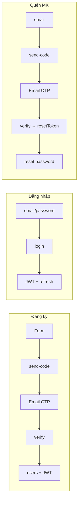

# NomNom — Xác thực người dùng (tài liệu nội bộ)

> Cập nhật theo code hiện tại. Chỉ **khách hàng (customer)** qua **email**. Merchant/driver/admin: đăng nhập email/MK có, đăng ký riêng chưa.

---

## Tổng quan

| Thành phần | Vai trò |
|------------|---------|
| **Access token** | JWT, ngắn (~15 phút), gửi header `Authorization: Bearer` |
| **Refresh token** | Chuỗi random 96 hex, hash SHA-256 lưu DB, dùng lấy access mới |
| **OTP** | 6 chữ số random, hash bcrypt lưu `otp_codes`, gửi email |
| **Reset token** | JWT riêng (15 phút), sau khi OTP quên MK đúng |

**Client lưu token:** `localStorage` (ghi nhớ) hoặc `sessionStorage` (không ghi nhớ).

**File chính**

- Server: `server/src/routes/auth.routes.js`, `server/src/lib/auth.js`, `registration.js`, `passwordReset.js`, `otp.js`, `mail.js`
- Client: `client/src/pages/auth/*`, `client/src/lib/api.js`, `authStorage.js`, `RequireAuth.jsx`, `RedirectIfAuthed.jsx`

---

## Mật khẩu

- Đăng ký / đổi MK: tối thiểu **8 ký tự**
- Lưu DB: **bcrypt** (cost 10), cột `users.password_hash`
- Seed test (`database/nomnom.sql`): mật khẩu **`password123`**

---

## OTP (dùng chung)

| Thuộc tính | Giá trị |
|------------|---------|
| Độ dài | 6 chữ số (`100000`–`999999`, `crypto.randomInt`) |
| Lưu DB | `otp_codes.code_hash` (bcrypt), **không** lưu plain |
| Hiệu lực | **10 phút** |
| Sai tối đa | **5 lần** → phải gửi lại mã |
| Kênh hiện tại | `email` |
| `purpose` | `register` \| `reset_password` (enum DB) |

**Gửi mail:** Nodemailer + Gmail SMTP (`server/.env`). Dev không SMTP → in mã ra **console server**.

**Email:** logo inline `cid` + file `logo-email.png` (~1KB, tránh Gmail cắt mail).

---

## 1. Đăng ký khách (customer)

```
/register → POST send-code → /verify-otp → POST verify → vào /app (đã login)
```

### Bước 1 — Gửi mã (`POST /api/v1/auth/register/send-code`)

**Body:** `{ fullName, email, password }`

1. Chỉ role `customer` (không cho merchant/driver ở form này)
2. Email chưa có trong `users`
3. Lưu tạm **`registration_pending`**: email, tên, `password_hash`, avatar Dicebear (`seed = fullName`), hết hạn **30 phút**
4. Tạo OTP `purpose=register`, gửi email
5. Trả `ok` + `expiresInMinutes`

### Bước 2 — Xác minh (`POST /api/v1/auth/register/verify`)

**Body:** `{ email, code }`

1. Kiểm tra OTP (hash, hạn, attempts)
2. Đọc `registration_pending` còn hạn
3. `INSERT users` + `user_roles(customer)` + `customer_profiles`
4. Xóa `registration_pending`
5. Cấp **access + refresh** → client lưu token → redirect `/app`

**Gửi lại mã:** `POST /api/v1/auth/register/resend-code` `{ email }` — cần còn bản ghi pending.

---

## 2. Đăng nhập

```
/login → POST login → lưu token → redirect (next hoặc theo role)
```

**Body:** `{ email, password, rememberMe?: boolean }` (mặc định `rememberMe = true`)

1. Tìm `users` theo email, `status = active`
2. `bcrypt.compare` mật khẩu
3. `INSERT refresh_tokens` (hạn: **30 ngày** nếu ghi nhớ, **1 ngày** nếu không)
4. Trả access + refresh + `user` (kèm `roles`)

**Ghi nhớ đăng nhập**

| Checkbox | Client | Server refresh TTL |
|----------|--------|-------------------|
| Bật | `localStorage` | `JWT_REFRESH_DAYS` (mặc định 30) |
| Tắt | `sessionStorage` | `JWT_REFRESH_SESSION_DAYS` (mặc định 1) |

**Sau login:** `resolveLoginRedirect(next, user)` — `next` hợp role thì dùng, không thì `/app` | `/merchant` | `/driver` | `/admin`.

**Chưa làm:** tab đăng nhập SĐT / OTP.

---

## 3. Quên mật khẩu

```
/forgot-password → send-code → /verify-otp?purpose=reset_password → verify → /reset-password?token=... → reset → /login
```

### Gửi mã (`POST /api/v1/auth/forgot-password/send-code`)

**Body:** `{ email }`

- Email **có** user active → tạo OTP `reset_password`, gửi mail
- Email **không** có → vẫn trả message chung (không lộ email tồn tại hay không)

### Xác minh OTP (`POST /api/v1/auth/forgot-password/verify`)

**Body:** `{ email, code }`

1. OTP đúng → `consumed_at`
2. Trả **`resetToken`** (JWT 15 phút, `purpose: password_reset`)

### Đặt MK mới (`POST /api/v1/auth/forgot-password/reset`)

**Body:** `{ resetToken, password }`

1. Verify JWT reset
2. `UPDATE users.password_hash`
3. **Revoke tất cả** `refresh_tokens` của user
4. Về login, không tự đăng nhập

**Gửi lại mã:** `POST /api/v1/auth/forgot-password/resend-code`

**Chưa làm:** quên MK qua SMS.

---

## 4. Phiên JWT (sau khi đã login)

| API | Mô tả |
|-----|--------|
| `GET /api/v1/auth/me` | Cần Bearer access → trả `user` + roles |
| `POST /api/v1/auth/refresh` | Body `{ refreshToken }` → access mới + refresh mới (rotate, revoke cũ) |
| `POST /api/v1/auth/logout` | Body `{ refreshToken }` (optional) → revoke token đó |

**Client:** `apiFetch` gặp 401 → gọi refresh → gửi lại request.

**Khôi phục khi mở app:** có token trong storage → `fetchMe()` → set `user` trong `AppContext`.

---

## 5. Route guard (client)

| Guard | Khi nào |
|-------|---------|
| `RedirectIfAuthed` | Đã login mà vào `/login`, `/register`, `/forgot-password`, `/verify-otp`, `/reset-password` → **`/app`** |
| `RequireAuth role=...` | Chưa login vào `/merchant/*`, `/driver/*`, `/admin/*` → **`/login?next=...`** |

Trang pháp lý (`/dieu-khoan-su-dung`, `/chinh-sach-bao-mat`): không chặn.

---

## 6. Database liên quan

| Bảng | Dùng cho |
|------|----------|
| `users` | Tài khoản, `password_hash`, `email_verified_at` (set khi đăng ký OTP xong) |
| `user_roles` | `customer`, `merchant`, `driver`, `admin` |
| `customer_profiles` | Tạo khi đăng ký customer |
| `registration_pending` | Form đăng ký chờ OTP (PK: `email`) |
| `otp_codes` | Mã OTP (hash), `purpose`, `destination` = email |
| `refresh_tokens` | Phiên đăng nhập (hash refresh, `expires_at`, `revoked_at`) |

Schema đầy đủ: **`database/nomnom.sql`**.

---

## 7. Biến môi trường (`server/.env`)

```env
JWT_SECRET=...
JWT_ACCESS_TTL=15m
JWT_REFRESH_DAYS=30
JWT_REFRESH_SESSION_DAYS=1

SMTP_HOST=smtp.gmail.com
SMTP_PORT=587
SMTP_USER=...
SMTP_PASS=...          # App password Gmail, không dấu cách
SMTP_FROM=NomNom       # Tên hiển thị (địa chỉ gửi = SMTP_USER)

# Tuỳ chọn: logo email qua URL public
# EMAIL_LOGO_URL=https://...
```

---

## 8. Chưa làm (auth)

- OTP đăng nhập / quên MK **SMS**
- Đăng ký merchant / driver
- Đổi mật khẩu trong profile (đã login)
- Rate limit OTP / login
- `requireAuth` trên API nghiệp vụ (orders, checkout, …) — hiện chỉ `/me`
- OAuth, 2FA

---

## Sơ đồ nhanh


