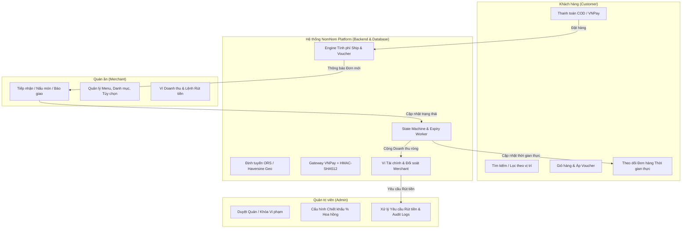
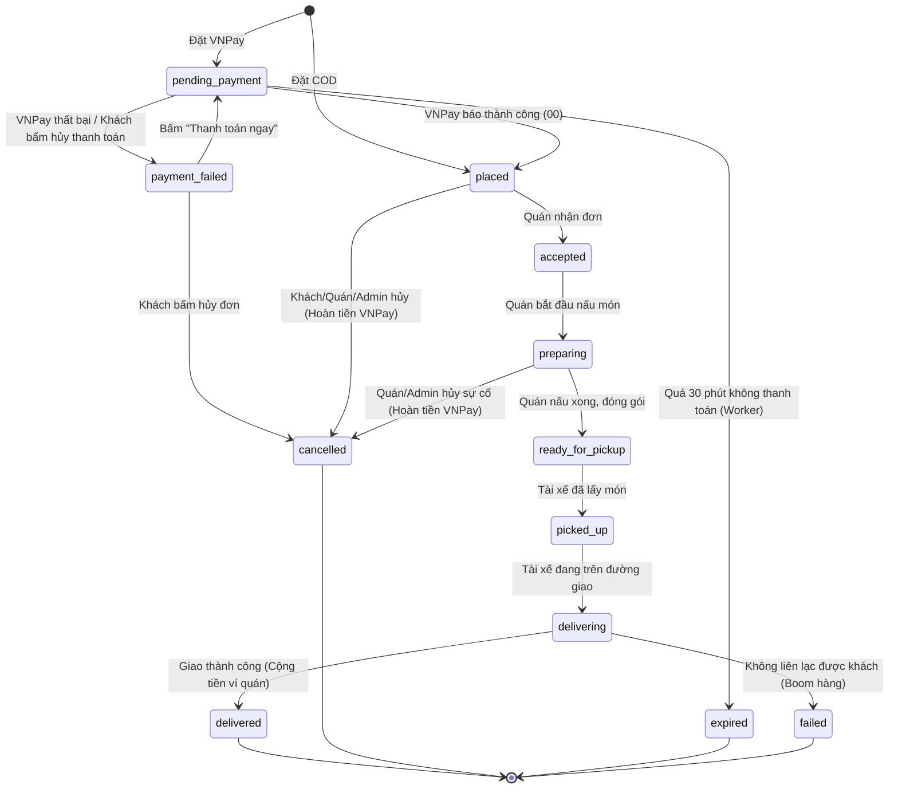
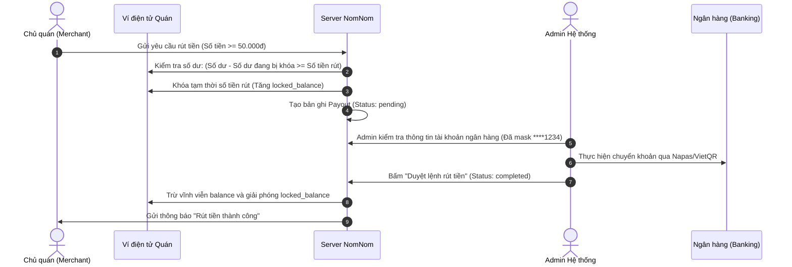

# 🎓 NOMNOM ARCHITECTURE & BUSINESS LOGIC DEFENSE WIKI
> **CẨM NANG TOÀN DIỆN VỀ NGHIỆP VỤ, CÔNG THỨC TÍNH TOÁN & BỘ CÂU HỎI PHẢN BIỆN BẢO VỆ ĐỒ ÁN**
> *Hệ thống Nền tảng Đặt & Giao đồ ăn Trực tuyến NomNom (Food Delivery Platform)*

---

## 📑 MỤC LỤC
1. [Tổng quan Kiến trúc & Mô hình 3 Bên (Three-Sided Marketplace)](#1-tổng-quan-kiến-trúc--mô-hình-3-bên)
2. [Module 1: Định vị Địa lý, Khoảng cách & Tính Phí Giao hàng](#2-module-1-định-vị-địa-lý-khoảng-cách--tính-phí-giao-hàng)
3. [Module 2: Giỏ hàng, Đặt món & Ràng buộc Đa quán ăn](#3-module-2-giỏ-hàng-đặt-món--ràng-buộc-đa-quán-ăn)
4. [Module 3: Động cơ Khuyến mãi, Voucher & Phân bổ Ngân sách](#4-module-3-động-cơ-khuyến-mãi-voucher--phân-bổ-ngân-sách)
5. [Module 4: Thanh toán (COD vs VNPay), Chữ ký Số & Hoàn tiền Tự động](#5-module-4-thanh-toán-cod-vs-vnpay-chữ-ký-số--hoàn-tiền-tự-động)
6. [Module 5: Vòng đời Đơn hàng & Máy trạng thái (Order State Machine)](#6-module-5-vòng-đời-đơn-hàng--máy-trạng-thái)
7. [Module 6: Ma trận Xử lý Hủy đơn, Bồi thường & Hoàn trả](#7-module-6-ma-trận-xử-lý-hủy-đơn-bồi-thường--hoàn-trả)
8. [Module 7: Tài chính Quán ăn, Ví điện tử & Quyết toán Rút tiền (Payouts)](#8-module-7-tài-chính-quán-ăn-ví-điện-tử--quyết-toán-rút-tiền)
9. [Module 8: Đánh giá, Xếp hạng Sao & Kiểm duyệt Nội dung](#9-module-8-đánh-giá-xếp-hạng-sao--kiểm-duyệt-nội-dung)
10. [Module 9: Trò chuyện Thời gian thực, Thông báo & Nhật ký Đối soát (Audit Logs)](#10-module-9-trò-chuyện-thời-gian-thực-thông-báo--nhật-ký-đối-soát)
11. [🎯 BỘ 20 CÂU HỎI HÓC BÚA CỦA BAN GIÁM KHẢO & CÂU TRẢ LỜI CHUẨN ĐIỂM 10](#11-bộ-20-câu-hỏi-hóc-búa-của-ban-giám-khảo--câu-trả-lời-chuẩn-điểm-10)

---

## 1. TỔNG QUAN KIẾN TRÚC & MÔ HÌNH 3 BÊN

NomNom vận hành theo mô hình **Three-Sided Marketplace** (Sàn giao dịch 3 bên):
1. **Customer (Khách hàng):** Tìm quán ăn gần nhất, chọn món theo tùy chọn/topping, áp dụng voucher, thanh toán trực tuyến hoặc tiền mặt, theo dõi tài xế giao hàng.
2. **Merchant (Quán ăn):** Đăng ký gian hàng, quản lý thực đơn, nhận và chế biến đơn theo quy trình bếp, quản lý dòng tiền doanh thu ròng và tạo lệnh rút tiền về tài khoản ngân hàng.
3. **Admin (Ban quản trị):** Kiểm duyệt quán ăn mới, thiết lập phí hoa hồng sàn (Commission Rate), duyệt lệnh rút tiền, giám sát đơn hàng và bảo vệ tính toàn vẹn hệ thống qua Nhật ký kiểm toán (Audit Logs).

---

## 2. MODULE 1: ĐỊNH VỊ ĐỊA LÝ, KHOẢNG CÁCH & TÍNH PHÍ GIAO HÀNG

### 2.1. Công thức Tính Khoảng cách Thực tế (Distance Calculation)
* **Tọa độ chuẩn (WGS 84):** Quán ăn và Địa chỉ giao hàng của khách đều có cặp tọa độ `(latitude, longitude)` hợp lệ (Vĩ độ $-90 \le \text{lat} \le 90$, Kinh độ $-180 \le \text{lon} \le 180$).
* **Định tuyến chuẩn (Primary Routing API):** Sử dụng **OpenRouteService (ORS) API** (Driving-Car mode) để lấy khoảng cách đường đi thực tế qua mạng lưới giao thông.
* **Định tuyến dự phòng (Fallback - Haversine Formula):** Khi mạng chập chờn hoặc không có API Key, hệ thống tự động fallback về công thức hình học mặt cầu Haversine kết hợp **Hệ số uốn lượn đường phố $1.3$** (Road Curvature Factor):
  $$\Delta \text{lat} = \text{lat}_2 - \text{lat}_1, \quad \Delta \text{lon} = \text{lon}_2 - \text{lon}_1$$
  $$a = \sin^2\left(\frac{\Delta \text{lat}}{2}\right) + \cos(\text{lat}_1) \cdot \cos(\text{lat}_2) \cdot \sin^2\left(\frac{\Delta \text{lon}}{2}\right)$$
  $$d_{\text{chim bay}} = 2 \cdot R \cdot \text{atan2}\left(\sqrt{a}, \sqrt{1-a}\right) \quad (\text{với } R = 6.371\text{ km})$$
  $$d_{\text{thực tế}} = d_{\text{chim bay}} \times 1.3$$

### 2.2. Công thức Tính Phí Giao hàng & Thời gian Giao hàng Dự kiến
* **Bán kính phục vụ tối đa:** **12.0 km**. Nếu $d_{\text{thực tế}} > 12\text{ km}$, hệ thống từ chối tạo đơn với mã lỗi `SHIPPING_DISTANCE_UNSUPPORTED` để đảm bảo thức ăn không bị nguội/hỏng.
* **Công thức Phí Giao hàng bậc thang:**
  $$\text{Phí giao hàng} = \min\Big(50.000\text{đ}, \; 15.000\text{đ} + \lceil d_{\text{thực tế}} \rceil \times 5.000\text{đ}\Big)$$
  * *Ví dụ:* Khoảng cách $2.3\text{ km} \rightarrow \lceil 2.3 \rceil = 3 \rightarrow 15.000 + 3 \times 5.000 = 30.000\text{đ}$.
  * *Ví dụ:* Khoảng cách $0.8\text{ km} \rightarrow \lceil 0.8 \rceil = 1 \rightarrow 15.000 + 1 \times 5.000 = 20.000\text{đ}$.
* **Thời gian giao dự kiến:** Tính toán dựa trên vận tốc trung bình đô thị $24\text{ km/h}$:
  $$\text{Thời gian (phút)} = \max\left(1, \; \left\lceil \frac{d_{\text{thực tế}}}{24} \times 60 \right\rceil\right)$$

---

## 3. MODULE 2: GIỎ HÀNG, ĐẶT MÓN & RÀNG BUỘC ĐA QUÁN ĂN

### 3.1. Ràng buộc Đơn nhà hàng (Single-Restaurant Cart Constraint)
* **Nghiệp vụ chuẩn:** Một đơn hàng chỉ được phép chứa các món ăn từ **duy nhất 1 quán ăn**.
* **Xử lý khi khách thêm món từ quán khác:**
  * Client hiển thị Modal cảnh báo: *"Bạn có muốn tạo giỏ hàng mới? Việc thêm món từ [Quán B] sẽ xóa các món hiện có từ [Quán A]"*.
  * Nếu khách bấm đồng ý: Backend xóa toàn bộ `cart_items` cũ và thêm món mới của Quán B vào giỏ.

### 3.2. Cấu trúc Món ăn, Tùy chọn (Options) & Topping
* **Giá món tổng thể:**
  $$\text{Giá 1 phần} = \text{Giá gốc món} + \sum \text{Giá Option/Topping chọn thêm}$$
  $$\text{Tổng tiền món} = \text{Giá 1 phần} \times \text{Số lượng}$$
* **Kiểm tra tính khả dụng của món:** Khi vào trang Checkout, backend kiểm tra lại toàn bộ trạng thái `is_available` của các món. Nếu quán vừa tắt món trong lúc khách đang chọn, hệ thống từ chối thanh toán và thông báo rõ món nào đã hết.

---

## 4. MODULE 3: ĐỘNG CƠ KHUYẾN MÃI, VOUCHER & PHÂN BỔ NGÂN SÁCH

### 4.1. Điều kiện Áp dụng Voucher (4 Cấp độ Bảo vệ)
1. **Trạng thái & Thời gian:** `v.status = 'active'` VÀ `starts_at <= NOW() <= ends_at`.
2. **Ngân sách Sàn / Quán (Global Usage Limit):**
   $$\sum \text{Lượt dùng} (\text{status} \in \{\text{'reserved'}, \text{'redeemed'}\}) < \text{usage\_limit}$$
3. **Giới hạn Mỗi Khách hàng (Per-User Limit):**
   $$\sum_{\text{user}} \text{Lượt dùng} < \text{per\_user\_limit (mặc định 1)}$$
4. **Đơn tối thiểu & Phạm vi Quán:**
   * $\text{Subtotal (Tiền món)} \ge \text{min\_order\_amount}$.
   * Nếu `v.restaurant_id IS NOT NULL`, đơn hàng phải đúng của quán đó. Nếu `v.restaurant_id IS NULL`, áp dụng toàn sàn.

### 4.2. Công thức Tính Giảm giá
* **Loại Giảm theo Tỷ lệ Phần trăm (`percent`):**
  $$\text{Số tiền giảm} = \min\left(\text{max\_discount\_amount}, \; \text{Math.round}\left(\frac{\text{Subtotal} \times \text{amount}}{100}\right)\right)$$
* **Loại Giảm số tiền Cố định (`fixed`):**
  $$\text{Số tiền giảm} = \min\left(\text{Subtotal}, \; \text{amount}\right)$$
  *(Đảm bảo số tiền giảm không bao giờ vượt quá tổng tiền món).*

### 4.3. Bảng Phân loại Voucher theo Nguồn Ngân sách

| Thuộc tính | Voucher Toàn sàn (Platform Voucher) | Voucher Riêng của Quán (Merchant Voucher) |
| :--- | :--- | :--- |
| **Người tạo** | Admin hệ thống NomNom | Chủ quán ăn (Merchant) |
| **Phạm vi** | Áp dụng cho mọi quán ăn trên sàn | Chỉ áp dụng khi đặt món tại chính quán đó |
| **Bên chịu chi phí** | **Sàn NomNom tài trợ 100%** (Quán vẫn nhận đủ tiền món) | **Quán ăn tự tài trợ** (Trừ trực tiếp vào doanh thu của quán) |
| **Thuật toán ví** | `merchantBillableSubtotal = subtotal` | `merchantBillableSubtotal = subtotal - discount` |

---

## 5. MODULE 4: THANH TOÁN (COD VS VNPAY), CHỮ KÝ SỐ & HOÀN TIỀN TỰ ĐỘNG

### 5.1. Hai Phương thức Thanh toán: COD vs VNPay
* **COD (Cash on Delivery):** Khách trả tiền mặt cho tài xế khi nhận đồ ăn. Trạng thái thanh toán khởi tạo: `unpaid`. Chuyển sang `paid` khi đơn hàng giao thành công (`delivered`).
* **VNPay (Cổng thanh toán Trực tuyến):**
  * Khởi tạo đơn với `status = 'pending_payment'`, `payment_status = 'pending'`.
  * Khách được chuyển hướng sang Cổng VNPay Sandbox quét mã QR/thẻ ATM.
  * Khi VNPay redirect về Return URL & gửi IPN Callback:
    * Kiểm tra chữ ký bảo mật **HMAC-SHA512**.
    * Kiểm tra mã phản hồi `vnp_ResponseCode === '00'`.
    * Cập nhật `status = 'placed'`, `payment_status = 'paid'`, `paid_at = NOW()`.
    * Chuyển trạng thái voucher từ `reserved` sang `redeemed`.

### 5.2. Chữ ký Điện tử HMAC-SHA512 & Bảo mật Chống Giả mạo Dữ liệu
* **Thuật toán ký:** Toàn bộ tham số gửi sang VNPay (hoặc nhận từ VNPay) được lọc bỏ tham số rỗng, sắp xếp theo thứ tự bảng chữ cái alphabet (ASCII Sort), mã hóa URL, nối thành chuỗi Query String và băm với Secret Key:
  $$\text{SignData} = \text{k}_1=\text{v}_1\ \&\ \text{k}_2=\text{v}_2\ \&\ \dots\ \&\ \text{k}_n=\text{v}_n$$
  $$\text{SecureHash} = \text{crypto.createHmac('sha512', HashSecret).update(SignData).digest('hex')}$$
* **Chống gian lận sửa đổi số tiền:** Backend so sánh trực tiếp số tiền nhận từ VNPay `Number(vnp_Amount) / 100` với số tiền `order.total_amount` lưu trong Database. Nếu có sự sai lệch (dù chỉ 1 đồng), giao dịch bị từ chối ngay lập tức.

### 5.3. Quy trình Hoàn tiền Tự động VNPay (Automated Refund API)
Khi đơn hàng VNPay đã thanh toán (`paid`) bị hủy hợp lệ (Khách hủy trước khi quán nhận, Quán hủy do hết món, hoặc Admin can thiệp):
1. Backend khởi tạo gói tin hoàn tiền chuẩn VNPay:
   * `vnp_Command`: `'refund'`
   * `vnp_TransactionType`: `'02'` (Hoàn trả toàn phần)
   * `vnp_Amount`: `order.total_amount * 100`
   * `vnp_CreateBy`: Email/Tên người thực hiện hủy
2. Ký băm HMAC-SHA512 chuỗi dữ liệu hoàn tiền:
   $$\text{Checksum} = \text{HMAC-SHA512}\Big(\text{RequestId}|\text{Version}|\text{Command}|\text{TmnCode}|\text{Type}|\text{TxnRef}|\text{Amount}|\dots\Big)$$
3. Gửi Request sang cổng Refund Endpoint của VNPay.
4. Cập nhật Database: `orders.payment_status = 'refunded'`.

---

## 6. MODULE 5: VÒNG ĐỜI ĐƠN HÀNG & MÁY TRẠNG THÁI (STATE MACHINE)

### Chi tiết các Trạng thái trong Hệ thống:
1. **`pending_payment`:** Đang chờ khách quét mã VNPay. Đơn hàng tạm giữ voucher và tồn kho.
2. **`payment_failed`:** Thanh toán VNPay bị gián đoạn. Khách có thể bấm **"Thanh toán ngay"** để thanh toán lại hoặc **"Hủy đơn"**.
3. **`placed`:** Đơn hàng đã đặt thành công (COD hoặc VNPay đã trả tiền), đang chờ quán ăn bấm xác nhận.
4. **`accepted`:** Quán ăn đã xác nhận nhận đơn.
5. **`preparing`:** Quán đang nấu nướng trong bếp.
6. **`ready_for_pickup`:** Món ăn đã đóng gói xong, chờ shipper đến lấy.
7. **`picked_up`:** Shipper đã nhận món từ quán.
8. **`delivering`:** Shipper đang di chuyển đến địa chỉ của khách.
9. **`delivered`:** Khách đã nhận đồ ăn thành công $\rightarrow$ Giao dịch hoàn tất, kích hoạt đánh giá và cộng tiền vào Ví quán.
10. **`cancelled`:** Đơn bị hủy (Tự động hoàn tiền VNPay nếu có + Hoàn lượt voucher).
11. **`expired`:** Quá hạn 30 phút mà chưa thanh toán online.
12. **`failed`:** Giao hàng thất bại (ví dụ: khách không nhận cuộc gọi giao hàng).

---

## 7. MODULE 6: MA TRẬN XỬ LÝ HỦY ĐƠN, BỒI THƯỜNG & HOÀN TRẢ

| Kịch bản | Bên hủy | Trạng thái đơn | Xử lý Tiền hàng | Xử lý Voucher | Quyền lợi & Trách nhiệm |
| :--- | :--- | :--- | :--- | :--- | :--- |
| **Khách đổi ý khi chưa trả tiền** | Khách hàng | `pending_payment` / `payment_failed` | Chưa trừ tiền $\rightarrow$ Không cần hoàn. | Hoàn trả 100% lượt dùng về kho của khách. | Không ai bị thiệt hại. |
| **Khách hủy đơn COD vừa đặt** | Khách hàng | `placed` (Quán chưa bấm nhận) | Chưa thu tiền mặt. | Hoàn trả 100% lượt dùng về kho của khách. | Cho phép hủy vì quán chưa sơ chế nguyên liệu. |
| **Khách hủy đơn VNPay vừa đặt** | Khách hàng | `placed` (Quán chưa bấm nhận) | **Hoàn 100% tiền VNPay** về tài khoản khách. | Hoàn trả 100% lượt dùng về kho của khách. | Khách nhận lại tiền trong tài khoản sau khi VNPay xử lý. |
| **Khách muốn hủy khi Quán đang nấu** | Khách hàng | `accepted` / `preparing` | **Khóa quyền tự hủy của khách.** | Không hoàn. | Bảo vệ quán ăn tránh lãng phí thực phẩm và công nấu nướng. |
| **Quán hết món / Đóng cửa đột xuất** | Quán ăn | `placed` / `accepted` / `preparing` | **Hoàn 100% tiền VNPay** cho khách. | Hoàn trả 100% lượt dùng về kho của khách. | Gửi thông báo kèm lý do quán hủy cho khách hàng. |
| **Admin can thiệp sự cố** | Admin | Mọi trạng thái trước `delivered` | **Hoàn 100% tiền VNPay** cho khách. | Hoàn trả 100% lượt dùng về kho của khách. | Ghi vết hành động vào bảng `audit_logs` để đối soát. |
| **Quá hạn thanh toán 30 phút** | Hệ thống (Worker) | `pending_payment` | Không phát sinh tiền. | Hoàn trả 100% lượt dùng về kho của khách. | Giải phóng voucher và giỏ hàng tự động. |

---

## 8. MODULE 7: TÀI CHÍNH QUÁN ĂN, VÍ ĐIỆN TỬ & QUYẾT TOÁN RÚT TIỀN

### 8.1. Công thức Phân chia Dòng tiền & Hoa hồng Sàn (Revenue Share)
Khi đơn hàng hoàn thành (`delivered`), hệ thống tự động phân chia dòng tiền theo công thức:
1. **Giá trị tính hóa đơn của quán (Merchant Billable Subtotal):**
   * Nếu là Voucher toàn sàn (Sàn tài trợ): $\text{merchantBillableSubtotal} = \text{Tiền món (Subtotal)}$.
   * Nếu là Voucher của quán (Quán tài trợ): $\text{merchantBillableSubtotal} = \text{Tiền món} - \text{Tiền giảm giá}$.
2. **Chiết khấu hoa hồng Sàn (Platform Commission):**
   $$\text{Phí hoa hồng sàn} = \text{Math.floor}\left(\text{merchantBillableSubtotal} \times \frac{\text{commission\_rate}}{100}\right)$$
   *(Tỷ lệ commission_rate mặc định là 10% - 15%, do Admin thiết lập).*
3. **Doanh thu ròng của Quán (Merchant Net Earnings):**
   $$\text{Doanh thu thực nhận} = \text{merchantBillableSubtotal} - \text{Phí hoa hồng sàn}$$
   *(Số tiền này được cộng ngay vào Số dư khả dụng `wallet_balance` của Quán).*
4. **Doanh thu thực thu của Sàn NomNom (Platform Revenue):**
   $$\text{Doanh thu Sàn} = \text{Phí hoa hồng sàn} + \text{Phí giao hàng (Delivery Fee)}$$

### 8.2. Quy trình Rút tiền về Tài khoản Ngân hàng (Payout Flow)

* **Quy tắc An toàn Tài chính:**
  * Số tiền rút phải là số nguyên dương $\ge 50.000\text{đ}$.
  * **Cơ chế Khóa số dư (Balance Locking):** Khi lệnh rút đang chờ duyệt (`pending` hoặc `processing`), số tiền này được đưa vào `locked_balance`. Quán không thể rút vượt quá `Số dư khả dụng = balance - locked_balance`, ngăn chặn hoàn toàn lỗi rút tiền 2 lần (Double Spending).
  * Nếu Admin từ chối lệnh rút (`rejected`): Số tiền bị khóa được giải phóng ngay lập tức trả về số dư khả dụng cho quán.

---

## 9. MODULE 8: ĐÁNH GIÁ, XẾP HẠNG SAO & KIỂM DUYỆT NỘI DUNG

### 9.1. Điều kiện Đánh giá (Verified Reviews Only)
* **Quy tắc:** Chỉ những khách hàng đã có đơn hàng giao thành công (`status = 'delivered'`) mới được quyền đánh giá.
* **Đánh giá đa tầng (Multi-level Rating):**
  1. **Đánh giá Quán ăn (Store Rating):** Số sao từ 1 đến 5 sao + Nhận xét tổng quan + Ảnh món thực tế.
  2. **Đánh giá từng Món ăn (Dish-level Rating):** Khách có thể chấm điểm chi tiết cho từng món trong đơn (ví dụ: Trà sữa 5 sao, Bánh ngọt 4 sao).

### 9.2. Công thức Điểm Đánh giá Trung bình (Average Rating)
$$\text{Rating trung bình Quán} = \frac{\sum \text{Số sao đánh giá của các đơn hợp lệ}}{\text{Tổng số lượt đánh giá}}$$
$$\text{Rating trung bình Món} = \frac{\sum \text{Số sao đánh giá riêng của món đó}}{\text{Tổng số lượt đánh giá món}}$$

### 9.3. Kiểm duyệt Đánh giá của Admin (Review Moderation)
* Admin có quyền ẩn các bình luận có nội dung phản cảm, thô tục hoặc spam cạnh tranh không lành mạnh (`is_hidden = 1`).
* Khi bình luận bị ẩn: Đánh giá đó không hiển thị công khai trên giao diện khách hàng nhưng vẫn lưu trong Database để phục vụ kiểm toán nội bộ.

---

## 10. MODULE 9: TRÒ CHUYỆN THỜI GIAN THỰC, THÔNG BÁO & NHẬT KÝ ĐỐI SOÁT

### 10.1. Động cơ Trò chuyện (Real-time In-App Chat)
* **Phạm vi:** Trò chuyện trực tiếp giữa Khách hàng và Quán ăn gắn liền với ngữ cảnh của từng đơn hàng cụ thể (`order_id`).
* **Tính năng:** Nhắn tin trao đổi ghi chú đặc biệt (ví dụ: *"Ít đá nhiều đường"*, *"Xin thêm tương ớt"*).
* **Bảo mật:** Chỉ đúng Khách hàng sở hữu đơn và Chủ quán nhận đơn đó mới có quyền đọc/ghi tin nhắn trong phòng chat.

### 10.2. Trung tâm Thông báo (Notification Engine)
Hệ thống tự động phát tín hiệu thông báo đa kênh theo 4 nhóm sự kiện:
1. **Sự kiện Đơn hàng:** Khi đơn được nhận, đang nấu, đang giao, giao thành công, hoặc bị hủy.
2. **Sự kiện Tài chính:** Khi nạp/rút tiền thành công, hoặc nhận tiền hoàn VNPay.
3. **Sự kiện Khuyến mãi:** Khi có voucher mới hoặc voucher sắp hết hạn.
4. **Sự kiện Tin nhắn:** Khi quán/khách gửi tin nhắn trong đơn hàng.

### 10.3. Nhật ký Kiểm toán Quản trị (Admin Audit Logs)
Mọi hành vi có tính chất thay đổi dữ liệu nhạy cảm của Quản trị viên đều được ghi lại bất biến (Immutable Logging) trong bảng `audit_logs`:
* **Thông tin lưu trữ:** `admin_id`, `action` (ví dụ: `duyet_nha_hang`, `huy_don_hang`, `duyet_rut_tien`, `khoa_tai_khoan`), `target_type` (restaurant/order/user), `target_id`, `details` (JSON), `ip_address`, `timestamp`.

---

## 11. 🎯 BỘ 20 CÂU HỎI HÓC BÚA CỦA BAN GIÁM KHẢO & CÂU TRẢ LỜI CHUẨN ĐIỂM 10

---

### ❓ Câu 1: *"Nếu 2 khách hàng cùng áp dụng 1 voucher chỉ còn đúng 1 lượt dùng duy nhất vào cùng một giây, hệ thống xử lý như thế nào để không bị âm số lượng?"*
> **💡 Trả lời:**
> *"Dạ thưa Thầy/Cô, hệ thống của em sử dụng **Database Transaction (Giao dịch CSDL) kết hợp Atomic Lock / Row Locking (`SELECT ... FOR UPDATE`)**. Khi kiểm tra lượt dùng của voucher, câu lệnh SQL sẽ đếm tổng số bản ghi trong bảng `voucher_redemptions` đang ở trạng thái `reserved` hoặc `redeemed`. Khách hàng nào gửi request đến trước sẽ được ghi nhận bản ghi `reserved` đầu tiên; request thứ hai đến sau dù chỉ vài mili-giây sẽ thấy số lượng đã đạt `usage_limit` và bị hệ thống từ chối áp dụng mã ngay tại tầng Controller trước khi tạo đơn hàng."*

---

### ❓ Câu 2: *"Khi khách đặt đơn VNPay, trừ tiền ngân hàng xong nhưng mạng của khách bị rớt không redirect về trang web được, đơn hàng có bị mất tiền oan không?"*
> **💡 Trả lời:**
> *"Dạ hoàn toàn không bị mất tiền ạ. Hệ thống NomNom tích hợp cơ chế **Webhook / IPN (Instant Payment Notification) Server-to-Server**. Khi khách thanh toán thành công trên cổng VNPay, máy chủ của VNPay sẽ gọi độc lập một HTTP POST request ngầm (IPN) trực tiếp đến máy chủ backend NomNom. Dù điện thoại khách bị tắt nguồn hay rớt mạng, backend vẫn nhận được tín hiệu IPN, xác thực chữ ký số HMAC-SHA512 và tự động chuyển trạng thái đơn hàng sang `paid` và `placed`."*

---

### ❓ Câu 3: *"Tại sao khách hàng đặt đơn COD rồi lại không được tự ý hủy khi quán đang nấu (`preparing`)?"*
> **💡 Trả lời:**
> *"Dạ thưa Thầy/Cô, đây là quy tắc nghiệp vụ cốt lõi của ngành F&B để bảo vệ đối tác nhà hàng. Khi đơn đã ở trạng thái `preparing`, quán ăn đã xuất nguyên liệu thực phẩm và tiến hành chế biến. Nếu cho phép khách tự do hủy đơn lúc này, quán ăn sẽ phải gánh chịu 100% thiệt hại chi phí thực phẩm hư hao. Trong trường hợp khách có việc khẩn cấp, khách phải liên hệ tổng đài hoặc quán để được hỗ trợ thỏa thuận."*

---

### ❓ Câu 4: *"Sự khác biệt về dòng tiền giữa Voucher do Sàn phát hành và Voucher do Quán phát hành là gì?"*
> **💡 Trả lời:**
> *"Dạ thưa Thầy/Cô, hệ thống phân biệt rất rõ 2 nguồn ngân sách:
> * **Voucher của Quán:** Tiền giảm giá được trừ trực tiếp vào doanh thu của quán (`merchantBillableSubtotal = subtotal - discount`).
> * **Voucher Toàn sàn:** Do Sàn NomNom tài trợ 100% để kích cầu. Quán ăn vẫn được ghi nhận doanh thu đầy đủ theo giá gốc món ăn (`merchantBillableSubtotal = subtotal`), sàn chỉ thu hoa hồng trên phần giá gốc đó và tự bỏ tiền túi bù khoản khuyến mãi cho khách."*

---

### ❓ Câu 5: *"Phí giao hàng được tính như thế nào nếu quán ăn và khách hàng nằm ở 2 bờ sông hoặc đường vòng quanh co?"*
> **💡 Trả lời:**
> *"Dạ, hệ thống ưu tiên gọi **OpenRouteService API** để lấy khoảng cách đường bộ xe máy lăn bánh thực tế. Trong trường hợp mạng gặp sự cố, hệ thống dùng công thức **Haversine tính đường chim bay nhân với Hệ số uốn lượn $1.3$** (Road Curvature Factor) để bù đắp các đoạn đường cong đô thị, đảm bảo phí giao hàng không bị tính quá thấp gây thiệt thòi cho chi phí vận chuyển."*

---

### ❓ Câu 6: *"Khi quán ăn gửi yêu cầu rút tiền 5 triệu đồng, nếu Admin chưa duyệt mà quán lại bấm rút tiếp 5 triệu nữa trong khi số dư chỉ có 6 triệu thì sao?"*
> **💡 Trả lời:**
> *"Dạ, hệ thống có cơ chế **Khóa số dư tạm thời (`locked_balance`)**. Khi quán tạo lệnh rút 5 triệu đầu tiên, số dư khả dụng thực tế chỉ còn $6 - 5 = 1\text{ triệu đồng}$. Khi quán cố gắng tạo lệnh rút thứ hai 5 triệu, backend sẽ kiểm tra điều kiện `available_balance >= amount` ($1\text{ triệu} < 5\text{ triệu}$) và từ chối lệnh rút ngay lập tức, ngăn chặn hoàn toàn lỗi Double Spending."*

---

### ❓ Câu 7: *"Nếu đơn hàng bị hủy, số lượt dùng voucher của khách có bị mất vĩnh viễn không?"*
> **💡 Trả lời:**
> *"Dạ không ạ. Trong bảng `voucher_redemptions`, mỗi lượt dùng có 3 trạng thái: `reserved` (tạm giữ), `redeemed` (đã dùng), và `released` (đã giải phóng). Khi đơn hàng bị hủy hợp lệ hoặc quá hạn 30 phút, hệ thống tự động chạy lệnh cập nhật `status = 'released'`. Khi đó, số lượt dùng của khách hàng và của toàn sàn tự động giảm đi 1, giúp khách hàng nhận lại mã voucher vào kho và có thể sử dụng lại cho đơn tiếp theo."*

---

### ❓ Câu 8: *"Làm sao hệ thống ngăn chặn việc khách hàng đánh giá ảo (Fake Reviews) để dìm hàng hoặc nâng điểm quán?"*
> **💡 Trả lời:**
> *"Dạ, NomNom áp dụng nguyên tắc **Chỉ Đánh giá Đơn hàng Xác thực (Verified Purchase Reviews)**. Khách hàng chỉ có thể gửi đánh giá khi đơn hàng tương ứng đã đạt trạng thái `delivered` (Giao thành công). Mỗi đơn hàng chỉ được đánh giá đúng 1 lần duy nhất, tránh việc spam đánh giá nhiều lần."*

---

### ❓ Câu 9: *"Nếu khách hàng đặt đồ ăn lúc 23:00 đêm nhưng không thanh toán VNPay thì đơn hàng có bị treo mãi mãi ở trạng thái chờ không?"*
> **💡 Trả lời:**
> *"Dạ không ạ. Backend NomNom có một tiến trình chạy ngầm **Expiry Worker (`expiry.worker.js`)** định kỳ kiểm tra hệ thống. Bất kỳ đơn hàng nào ở trạng thái `pending_payment` quá 30 phút mà chưa hoàn tất thanh toán sẽ tự động bị hủy chuyển sang `expired`, đồng thời hoàn trả lượt voucher và tồn kho món lại cho hệ thống."*

---

### ❓ Câu 10: *"Tại sao lại chia tiền hoa hồng của sàn theo % (Commission Rate) thay vì thu một khoản phí cố định trên mỗi đơn?"*
> **💡 Trả lời:**
> *"Dạ thưa Thầy/Cô, thu hoa hồng theo % (ví dụ 10% - 15%) là mô hình chuẩn quốc tế của GrabFood và ShopeeFood. Mô hình này đảm bảo tính công bằng: Đơn hàng nhỏ thì phí sàn nhỏ giúp quán dễ bán, đơn hàng giá trị cao thì sàn chia sẻ doanh thu tương xứng với giá trị đem lại. Ngoài ra, Admin có thể linh hoạt cấu hình tỷ lệ hoa hồng riêng cho từng đối tác quán ăn VIP trong hệ thống."*

---

### ❓ Câu 11: *"Thông tin tài khoản ngân hàng của quán ăn có bị lộ ra ngoài nếu nhân viên chăm sóc khách hàng nhìn vào màn hình Admin không?"*
> **💡 Trả lời:**
> *"Dạ không ạ. Hệ thống áp dụng chính sách **Masking dữ liệu nhạy cảm (Che giấu số tài khoản)**. Mọi API trả về cho giao diện đều chỉ hiển thị 4 chữ số cuối cùng (ví dụ `****1234`), chỉ khi đối soát thực hiện lệnh chuyển khoản chính thức mới sử dụng thông tin được bảo mật qua HTTPS."*

---

### ❓ Câu 12: *"Nếu một quán ăn bị Admin khóa tài khoản do vi phạm vệ sinh an toàn thực phẩm thì các đơn hàng đang trên đường giao có bị ảnh hưởng không?"*
> **💡 Trả lời:**
> *"Dạ, khi Admin khóa tài khoản quán ăn, hệ thống sẽ:
> 1. Ngay lập tức ẩn quán ăn khỏi danh sách tìm kiếm để không nhận thêm đơn mới.
> 2. Các đơn hàng đang thực hiện dở dang (`delivering`, `preparing`) vẫn được giữ nguyên luồng để shipper giao xong cho khách và tiền được giữ an toàn trong ví chờ Admin giải quyết tranh chấp."*

---

### ❓ Câu 13: *"Làm thế nào để đảm bảo khách hàng không thể chỉnh sửa số tiền thanh toán VNPay trên trình duyệt (F12 sửa HTML/JS)?"*
> **💡 Trả lời:**
> *"Dạ, toàn bộ số tiền thanh toán **đều do Backend tính toán độc lập** dựa trên giá món trong CSDL, khoảng cách thực tế và voucher hợp lệ. Client chỉ gửi yêu cầu đặt hàng, Backend tự tính ra `total_amount` rồi ký băm HMAC-SHA512 với Secret Key gửi sang VNPay. Phía Client không có cách nào can thiệp được số tiền đã được ký số mã hóa."*

---

### ❓ Câu 14: *"Trong trường hợp quán ăn hết nguyên liệu một món trong đơn 5 món của khách, quy trình xử lý chuẩn là gì?"*
> **💡 Trả lời:**
> *"Dạ, quán ăn có thể:
> 1. Mở tính năng **Chat Trực tiếp trong Đơn hàng** để trao đổi nhanh với khách đổi sang món tương đương.
> 2. Nếu khách không đồng ý đổi món, quán ăn chủ động bấm **Hủy đơn**. Khi đó hệ thống sẽ tự động hoàn 100% tiền online cho khách và hoàn lại voucher ngay lập tức."*

---

### ❓ Câu 15: *"Tại sao giỏ hàng lại giới hạn bán kính giao hàng tối đa 12km?"*
> **💡 Trả lời:**
> *"Dạ, đồ ăn thức uống có đặc thù chất lượng suy giảm rất nhanh theo thời gian và nhiệt độ (kem bị tan, bún phở bị trương, đồ chiên bị mềm). Khoảng cách 12km trong đô thị tương đương 30 - 45 phút di chuyển là ngưỡng tối đa đảm bảo vệ sinh an toàn thực phẩm và trải nghiệm ngon miệng cho người dùng."*

---

### ❓ Câu 16: *"Nếu khách hàng xóa tài khoản hoặc xóa địa chỉ thì lịch sử đơn hàng cũ có bị lỗi hiển thị (Null Pointer) không?"*
> **💡 Trả lời:**
> *"Dạ không ạ. Trong cơ sở dữ liệu NomNom, khi tạo đơn hàng, hệ thống thực hiện **Snapshot (Lưu bản sao tĩnh)** toàn bộ thông tin tại thời điểm đặt đơn gồm: Tên khách hàng, Số điện thoại nhận, Địa chỉ giao hàng đầy đủ, Tên quán, Tên món và Giá tiền vào bảng `orders` và `order_items`. Dù sau này quán đổi tên hay khách xóa địa chỉ, đơn hàng cũ trong lịch sử vẫn hiển thị chính xác 100%."*

---

### ❓ Câu 17: *"Tại sao lại cần bảng Audit Logs riêng cho Quản trị viên?"*
> **💡 Trả lời:**
> *"Dạ thưa Thầy/Cô, bảng Audit Logs là yêu cầu bắt buộc của các hệ thống tài chính thương mại điện tử để đảm bảo tính **Bất biến (Immutability) và Minh bạch (Accountability)**. Mọi thao tác nhạy cảm như Duyệt quán, Hủy đơn, Thay đổi hoa hồng sàn hay Duyệt rút tiền đều được ghi lại danh tính Admin, địa chỉ IP và thời gian thực để ngăn ngừa gian lận nội bộ."*

---

### ❓ Câu 18: *"Hệ thống xử lý phân trang (Pagination) ở Client hay Server và tại sao?"*
> **💡 Trả lời:**
> *"Dạ, ở các danh mục có khối lượng dữ liệu lớn như Lịch sử Đơn hàng, Quản trị Tài khoản và Danh sách Quán ăn, hệ thống thực hiện **Phân trang tại Server (Server-side Pagination)** bằng mệnh đề `LIMIT` và `OFFSET` trong MySQL. Điều này giúp giảm tải bộ nhớ RAM, tối ưu tốc độ tải trang dưới 1 giây và tiết kiệm băng thông mạng cho người dùng di động."*

---

### ❓ Câu 19: *"Khi khách hàng tìm kiếm 'Cơm tấm', hệ thống tìm kiếm theo cơ chế nào?"*
> **💡 Trả lời:**
> *"Dạ, hệ thống tìm kiếm đa chiều:
> 1. Tìm theo tên món ăn và danh mục món.
> 2. Tìm theo tên quán ăn và mô tả quán.
> 3. Lọc kết hợp với điều kiện vị trí địa lý để ưu tiên hiển thị những quán đang mở cửa và nằm trong bán kính giao hàng hợp lệ gần khách hàng nhất."*

---

### ❓ Câu 20: *"Nếu được phát triển tiếp trong tương lai, nhóm sẽ nâng cấp thêm những tính năng nào?"*
> **💡 Trả lời:**
> *"Dạ thưa Thầy/Cô, nếu có thêm thời gian phát triển, nhóm định hướng mở rộng 3 tính năng nâng cao:
> 1. **Tích hợp App Tài xế (Driver App):** Thuật toán tự động ghép đơn (Batching Orders) cho tài xế cùng một tuyến đường để tối ưu chi phí ship.
> 2. **AI Recommendation Engine:** Gợi ý món ăn theo sở thích cá nhân hóa và thói quen đặt món theo khung giờ (sáng, trưa, tối).
> 3. **Cơ chế Đặt trước (Pre-order / Scheduled Delivery):** Cho phép khách hàng lên lịch hẹn giờ giao món ăn chính xác vào các khung giờ tiệc hoặc họp công ty."*

---

> 🏆 **LỜI KHUYÊN DÀNH CHO NHÓM KHI THUYẾT TRÌNH:**
> * Giữ phong thái tự tin, trả lời rõ ràng từng câu hỏi theo cấu trúc: **Nghiệp vụ thực tế $\rightarrow$ Giải pháp kỹ thuật trong NomNom $\rightarrow$ Kết quả bảo vệ an toàn hệ thống**.
> * Nhấn mạnh vào tính thực tế: Hệ thống không chỉ là code demo mà đã tính toán đầy đủ dòng tiền, bảo vệ cả 3 bên (Khách - Quán - Sàn) và xử lý triệt để các trường hợp ngoại lệ (Edge cases).
