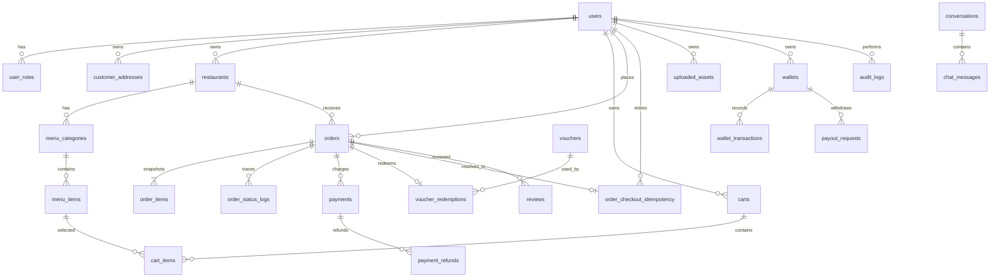

# ERD NomNom — phạm vi runtime ba vai trò

## 1. Nguyên tắc dữ liệu

- `users` + `user_roles` là gốc danh tính và phân quyền.
- Mọi dữ liệu khách/quán được ràng buộc quyền sở hữu ở API và foreign key.
- `orders` lưu snapshot địa chỉ, giá, phí, voucher và doanh thu tại lúc checkout.
- `order_status_logs`, `payments`, `payment_refunds`, `wallet_transactions` và `audit_logs`
  tạo dấu vết cho nghiệp vụ tiền/đơn.
- Checkout dùng `order_checkout_idempotency` để một retry trả lại cùng đơn.

## 2. Sơ đồ lõi



## 3. Cụm bảng

| Cụm | Bảng chính | Vai trò |
|---|---|---|
| Danh tính | `users`, `user_roles`, `refresh_tokens`, `otp_codes` | Auth, role, session rotation |
| Khách hàng | `customer_profiles`, `customer_addresses`, `carts`, `cart_items` | Hồ sơ và giỏ |
| Nhà hàng | `restaurants`, `restaurant_address_change_requests`, `menu_categories`, `menu_items`, `cuisines` | Catalog và vận hành |
| Đơn hàng | `orders`, `order_items`, `order_status_logs`, `order_checkout_idempotency` | Snapshot, state machine, retry |
| Thanh toán | `payments`, `payment_refunds`, `vouchers`, `voucher_redemptions` | VNPay/COD và khuyến mãi |
| Tài chính | `wallets`, `wallet_transactions`, `payout_requests`, `platform_config` | Đối soát nhà hàng/sàn |
| Tương tác | `reviews`, `notifications`, `conversations`, `chat_messages` | Hậu mãi và hỗ trợ |
| Quản trị | `audit_logs`, `home_page_settings`, `home_promo_banners`, `uploaded_assets` | Audit/nội dung/quyền ảnh |

## 4. Công thức snapshot tài chính

```text
total_amount = subtotal + delivery_fee - discount_amount
merchant_billable_subtotal = subtotal - merchant_funded_discount
platform_commission = floor(merchant_billable_subtotal * commission_rate / 100)
merchant_earning = merchant_billable_subtotal - platform_commission
platform_fee = platform_commission + delivery_fee
```

Voucher do sàn tài trợ không làm giảm `merchant_earning`. Phí giao được nền tảng giữ để thanh
toán hoạt động vận chuyển bên ngoài, theo ADR-001. Mọi số tiền dùng số nguyên VND.

## 5. Legacy không thuộc runtime

`driver_profiles`, `driver_assignments`, `orders.driver_id`, `orders.driver_earning` và các enum
`driver` được giữ tạm để tương thích dump/dữ liệu cũ. Không có route, trang hay use case công khai
sử dụng chúng. Kế hoạch contract: backup -> kiểm tra zero usage -> migration drop riêng -> restore
rehearsal; chỉ thực hiện sau báo cáo 03/09/2026.
