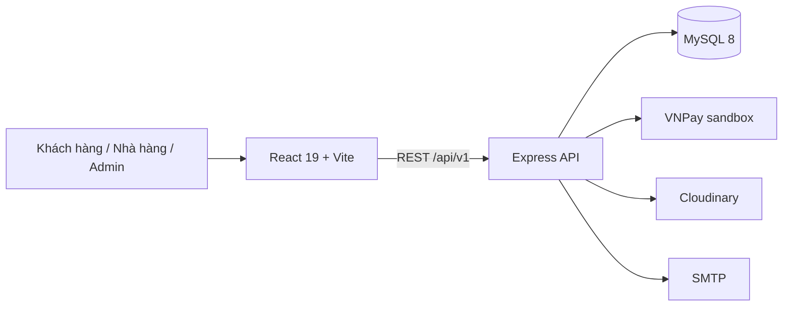

# Tổng quan dự án NomNom — phạm vi cuối

## 1. Sản phẩm

NomNom là nền tảng đặt và giao đồ ăn gồm ba nhóm người dùng: **Khách hàng**, **Nhà hàng**
và **Admin**. Nhà hàng tự tổ chức giao hàng hoặc thuê đối tác bên ngoài; NomNom không vận hành
lực lượng giao hàng riêng.

## 2. Giá trị theo vai trò

| Vai trò | Năng lực chính |
|---|---|
| Khách hàng | Tìm quán/món, giỏ hàng, địa chỉ, voucher, COD/VNPay, theo dõi đơn, chat, đánh giá |
| Nhà hàng | Onboarding, thực đơn, nhận–chuẩn bị–giao đơn, khuyến mãi, phản hồi review, ví/rút tiền |
| Admin | Duyệt quán, quản lý tài khoản/đơn, ngoại lệ/refund, đối soát, payout, cấu hình, audit |

## 3. Luồng nghiệp vụ chính

```text
Khách tạo đơn
  -> Nhà hàng nhận
  -> Nhà hàng chuẩn bị
  -> Sẵn sàng giao
  -> Nhà hàng bắt đầu giao
  -> Khách xác nhận đã nhận
  -> Ghi nhận doanh thu nhà hàng
```

Checkout khóa giỏ hàng trong transaction, tái kiểm tra quán/món/giá/voucher/phạm vi giao và
dùng `Idempotency-Key` để retry không tạo đơn trùng. Hủy đơn và hoàn tiền là hai quy trình khác
nhau; hệ thống không công bố hoàn tiền trước khi cổng thanh toán xác nhận.

## 4. Kiến trúc



- Frontend chia module theo ba vai trò, responsive mobile/desktop.
- Backend là REST API monolith, phân quyền tại middleware và theo quyền sở hữu tài nguyên.
- MySQL lưu snapshot tài chính/địa chỉ/món tại thời điểm đặt để phục vụ audit.
- Worker xử lý đơn hết hạn theo batch, không tự hủy đơn đã thanh toán cần refund.

## 5. Quyết định phạm vi

Xem [ADR-001](../decisions/ADR-001-three-role-delivery-model.md). Các cấu trúc tài xế trong
schema chỉ là legacy tương thích dữ liệu và không thuộc runtime/demo. Tài liệu bốn vai trò cũ
được lưu tại `docs/archive/legacy-four-role/` để truy vết, không dùng làm tài liệu bảo vệ.

## 6. Giới hạn được công bố

- Đây là đồ án học thuật, chưa tuyên bố đáp ứng SLA sản xuất quy mô lớn.
- VNPay cần credential sandbox và mạng; COD là phương án demo dự phòng.
- Giao hàng do nhà hàng/đơn vị ngoài hệ thống thực hiện, NomNom chỉ quản lý trạng thái.
