# NomNom — Phân tích Use Case

> Tài liệu này mô tả toàn diện **các tác nhân (Actors)** và **Use Case** của hệ thống NomNom, kèm sơ đồ Use Case tổng thể bằng Mermaid và hướng dẫn vẽ lại sơ đồ trên **diagrams.net (draw.io)** cho báo cáo tốt nghiệp.

---

## 1. Mục đích & Phạm vi

NomNom là nền tảng giao đồ ăn vận hành 4 vai trò: **Khách hàng** đặt món, **Nhà hàng** chuẩn bị đơn, **Tài xế** giao hàng, **Quản trị viên** vận hành nền tảng. Tài liệu này:

- Xác định 4 tác nhân chính + các tác nhân phụ (hệ thống bên ngoài).
- Liệt kê đầy đủ Use Case theo từng tác nhân.
- Chỉ ra mối quan hệ `<<include>>` và `<<extend>>`.
- Hướng dẫn vẽ sơ đồ trên diagrams.net với bố cục chuyên nghiệp.

---

## 2. Tác nhân (Actors)

### 2.1. Tác nhân chính

| # | Tác nhân | Mô tả | Mục tiêu |
|---|---|---|---|
| A1 | **Khách hàng** (Customer) | Người dùng cuối đặt món qua app/web | Đặt món nhanh, theo dõi đơn, đánh giá |
| A2 | **Chủ nhà hàng** (Merchant) | Người vận hành nhà hàng đối tác | Quản lý thực đơn, xử lý đơn, theo dõi doanh thu |
| A3 | **Tài xế** (Driver) | Người giao đồ ăn (đối tác giao hàng) | Nhận đơn phù hợp, hoàn tất giao hàng, rút tiền |
| A4 | **Quản trị viên** (Admin) | Nhân sự nội bộ NomNom | Duyệt tài khoản, giám sát vận hành, đối soát tài chính |

### 2.2. Tác nhân phụ (Supporting Actors)

| Tác nhân | Vai trò |
|---|---|
| **Cổng thanh toán VNPay** | Xử lý giao dịch online (sandbox cho môi trường demo) |
| **Dịch vụ Email** | Gửi mã OTP cho luồng đăng ký và đặt lại mật khẩu |

---

## 3. Danh sách Use Case theo tác nhân

### 3.1. Use Case dùng chung (5 UC)

| Mã | Use Case | Ghi chú |
|---|---|---|
| UC-G01 | Đăng ký tài khoản | `<<include>>` Xác thực OTP |
| UC-G02 | Đăng nhập | Email/SĐT + mật khẩu |
| UC-G03 | Đăng xuất | |
| UC-G04 | Quên mật khẩu / Đặt lại mật khẩu | `<<include>>` Xác thực OTP |
| UC-G05 | Cập nhật hồ sơ cá nhân | Ảnh đại diện, tên, SĐT |

### 3.2. Khách hàng (12 UC)

#### 3.2.1. Trục đặt món

| Mã | Use Case | Mô tả |
|---|---|---|
| UC-C01 | Tìm kiếm nhà hàng | Theo từ khóa, thành phố |
| UC-C02 | Xem chi tiết nhà hàng | Thực đơn, đánh giá, giờ mở cửa |
| UC-C03 | Thêm món vào giỏ hàng | Có thể thêm ghi chú |
| UC-C04 | Quản lý giỏ hàng | Tăng/giảm số lượng, xóa món |
| UC-C05 | Chọn / thêm địa chỉ giao hàng | Sổ địa chỉ |
| UC-C06 | Đặt món / Thanh toán đơn | `<<include>>` các UC bên dưới |
| UC-C07 | Theo dõi đơn hàng | Bản đồ + dòng thời gian trạng thái |
| UC-C08 | Hủy đơn hàng | `<<extend>>` UC-C07, có giới hạn theo trạng thái |

#### 3.2.2. Sau khi đơn hoàn tất

| Mã | Use Case | Mô tả |
|---|---|---|
| UC-C09 | Đánh giá nhà hàng | 1–5 sao + bình luận |
| UC-C10 | Xem lịch sử đơn hàng | |
| UC-C11 | Đặt lại đơn cũ (Re-order) | `<<include>>` UC-C06 |

#### 3.2.3. Quản lý cá nhân

| Mã | Use Case | Mô tả |
|---|---|---|
| UC-C12 | Quản lý sổ địa chỉ | Thêm / sửa / xóa, đặt mặc định |

### 3.3. Chủ nhà hàng (10 UC)

#### 3.3.1. Onboarding

| Mã | Use Case | Mô tả |
|---|---|---|
| UC-M01 | Đăng ký mở nhà hàng | Upload ảnh giấy phép kinh doanh + VSATTP |
| UC-M02 | Hoàn thiện thông tin nhà hàng | Logo, banner, mô tả, địa chỉ, phí giao mặc định |

#### 3.3.2. Quản lý thực đơn

| Mã | Use Case | Mô tả |
|---|---|---|
| UC-M03 | Quản lý danh mục thực đơn | Thêm / sửa / xóa / sắp xếp |
| UC-M04 | Quản lý món ăn | Tên, giá, ảnh, mô tả |
| UC-M05 | Bật / tắt còn hàng (in_stock) | Toggle nhanh |

#### 3.3.3. Vận hành đơn

| Mã | Use Case | Mô tả |
|---|---|---|
| UC-M06 | Bật / tắt nhận đơn | Mở/đóng cửa tạm thời |
| UC-M07 | Xem & xác nhận đơn mới | `<<extend>>` Từ chối có lý do |
| UC-M08 | Cập nhật trạng thái đơn | `accepted` → `preparing` → `ready_for_pickup` |

#### 3.3.4. Tài chính

| Mã | Use Case | Mô tả |
|---|---|---|
| UC-M09 | Xem ví & doanh thu | Số dư, lịch sử giao dịch, biểu đồ ngày/tuần |
| UC-M10 | Yêu cầu rút tiền (payout) | `<<include>>` UC-WLT-VAL |

### 3.4. Tài xế (10 UC)

#### 3.4.1. Onboarding

| Mã | Use Case | Mô tả |
|---|---|---|
| UC-D01 | Đăng ký làm tài xế | Upload CCCD, GPLX, ảnh chân dung |

#### 3.4.2. Phiên làm việc

| Mã | Use Case | Mô tả |
|---|---|---|
| UC-D02 | Bật trạng thái sẵn sàng (online) | `<<include>>` UC-D03 |
| UC-D03 | Cập nhật vị trí GPS định kỳ | App gửi vị trí lên server theo chu kỳ |

#### 3.4.3. Vòng đời giao đơn

| Mã | Use Case | Mô tả |
|---|---|---|
| UC-D04 | Xem danh sách đơn khả dụng | Đơn `ready_for_pickup` cùng thành phố |
| UC-D05 | Nhận đơn | First-come-first-serve, lock bằng UNIQUE constraint |
| UC-D06 | Xác nhận đã đến điểm lấy hàng | Mốc trạng thái |
| UC-D07 | Xác nhận đã lấy hàng | Mốc trạng thái |
| UC-D08 | Hoàn tất giao hàng | `<<include>>` UC-D09 + cộng tiền vào ví |

#### 3.4.4. Tài chính

| Mã | Use Case | Mô tả |
|---|---|---|
| UC-D09 | Tải ảnh xác nhận giao | Upload ảnh lên Cloudinary |
| UC-D10 | Xem ví & yêu cầu rút tiền | `<<include>>` UC-WLT-VAL |

### 3.5. Quản trị viên (8 UC)

#### 3.5.1. Tổng quan

| Mã | Use Case | Mô tả |
|---|---|---|
| UC-A01 | Đăng nhập backoffice | Email + mật khẩu |
| UC-A02 | Xem dashboard tổng quan | Số đơn, GMV, tổng tài xế / nhà hàng đang hoạt động |

#### 3.5.2. Duyệt tài khoản

| Mã | Use Case | Mô tả |
|---|---|---|
| UC-A03 | Duyệt hồ sơ nhà hàng đăng ký | Xem ảnh KYC → Approve/Reject |
| UC-A04 | Duyệt hồ sơ tài xế đăng ký | Xem ảnh KYC → Approve/Reject |

#### 3.5.3. Quản lý tài khoản

| Mã | Use Case | Mô tả |
|---|---|---|
| UC-A05 | Quản lý danh sách nhà hàng | Tìm, xem, đình chỉ |
| UC-A06 | Quản lý danh sách tài xế | Tìm, xem, đình chỉ |

#### 3.5.4. Tài chính

| Mã | Use Case | Mô tả |
|---|---|---|
| UC-A07 | Phê duyệt yêu cầu rút tiền | Approve → đánh dấu `completed` thủ công sau khi chuyển khoản |
| UC-A08 | Cấu hình tham số nền tảng | Hoa hồng, % chia tài xế, số rút tối thiểu |

---

## 4. Use Case nội bộ hệ thống (3 UC)

Đây là các Use Case **không có Actor con người trực tiếp** — kích hoạt bởi sự kiện hoặc cron, nhưng cần thể hiện trên sơ đồ vì các Use Case khác `<<include>>` chúng.

| Mã | Use Case | Kích hoạt bởi |
|---|---|---|
| UC-SYS01 | Tự động hủy đơn nếu nhà hàng không xác nhận trong 5 phút | Cron mỗi 1 phút |
| UC-SYS02 | Tính & ghi nhận hoa hồng + thu nhập tài xế khi đơn `delivered` | Sự kiện trong UC-D08 |
| UC-SYS03 | Cập nhật `rating_avg` cho nhà hàng sau review mới | Sự kiện trong UC-C09 |

---

## 5. Quan hệ `<<include>>` và `<<extend>>`

### 5.1. `<<include>>` — luôn xảy ra khi cha chạy

| Use Case cha | Use Case bao gồm |
|---|---|
| UC-G01 Đăng ký tài khoản | UC-OTP-VRF *Xác thực OTP* |
| UC-G04 Quên mật khẩu | UC-OTP-VRF |
| UC-C06 Đặt món | UC-PAY-CALC *Tính tổng đơn* |
| UC-C06 Đặt món | UC-PAY-AUTH *Xác thực thanh toán* (chỉ với VNPay) |
| UC-C11 Đặt lại đơn cũ | UC-C06 Đặt món |
| UC-D02 Bật online | UC-D03 Cập nhật vị trí GPS |
| UC-D08 Hoàn tất giao hàng | UC-D09 Tải ảnh xác nhận |
| UC-D08 Hoàn tất giao hàng | UC-WLT-CRED *Cộng tiền vào ví tài xế + nhà hàng* |
| UC-M10 Yêu cầu rút tiền (Merchant) | UC-WLT-VAL *Kiểm tra số dư khả dụng* |
| UC-D10 Yêu cầu rút tiền (Driver) | UC-WLT-VAL |

### 5.2. `<<extend>>` — chỉ xảy ra theo điều kiện

| Use Case cơ sở | Use Case mở rộng |
|---|---|
| UC-C07 Theo dõi đơn | UC-C08 Hủy đơn (trước trạng thái `accepted`) |
| UC-M07 Xem đơn mới | UC-M-REJECT *Từ chối đơn có lý do* |
| UC-A07 Phê duyệt payout | UC-A-REJECT *Từ chối payout có lý do* |

---

## 6. Sơ đồ Use Case tổng thể

Sơ đồ dưới đây dùng cú pháp **Mermaid `flowchart`** để biểu diễn UML Use Case Diagram. Vì Mermaid không có shape ellipse UML chuẩn, ta dùng quy ước:

- **Actor** — hộp bo tròn (`(( ))`) — gắn nhãn 👤 hoặc 🤖.
- **Use Case** — hộp tròn cạnh (`( )`) — bên trong System Boundary.
- **System Boundary** — `subgraph` bao quanh các use case.
- **Association** (Actor ↔ UC) — đường liền nét `---`.

```mermaid
flowchart LR
    %% =========================================================
    %%  NomNom — Sơ đồ Use Case tổng thể
    %% =========================================================

    %% --- Actors chính ---
    KH(("👤<br/>Khách hàng"))
    NH(("👤<br/>Chủ nhà hàng"))
    TX(("👤<br/>Tài xế"))
    AD(("👤<br/>Quản trị viên"))

    %% --- Actors phụ ---
    VNPAY(("🤖<br/>Cổng VNPay"))
    EMAIL(("🤖<br/>Dịch vụ Email"))

    %% --- System boundary ---
    subgraph SYS["🟦  HỆ THỐNG NOMNOM"]
        direction TB

        subgraph G_CHUNG["Use Case dùng chung"]
            G01(["UC-G01<br/>Đăng ký tài khoản"])
            G02(["UC-G02<br/>Đăng nhập"])
            G03(["UC-G03<br/>Đăng xuất"])
            G04(["UC-G04<br/>Quên mật khẩu"])
            G05(["UC-G05<br/>Cập nhật hồ sơ"])
            OTP(["UC-OTP-VRF<br/>Xác thực OTP"])
        end

        subgraph G_KH["Use Case Khách hàng"]
            C01(["UC-C01<br/>Tìm kiếm nhà hàng"])
            C02(["UC-C02<br/>Xem nhà hàng"])
            C03(["UC-C03<br/>Thêm vào giỏ"])
            C04(["UC-C04<br/>Quản lý giỏ"])
            C05(["UC-C05<br/>Chọn địa chỉ giao"])
            C06(["UC-C06<br/>Đặt món / Thanh toán"])
            C07(["UC-C07<br/>Theo dõi đơn"])
            C08(["UC-C08<br/>Hủy đơn"])
            C09(["UC-C09<br/>Đánh giá nhà hàng"])
            C10(["UC-C10<br/>Lịch sử đơn"])
            C11(["UC-C11<br/>Đặt lại đơn cũ"])
            C12(["UC-C12<br/>Quản lý sổ địa chỉ"])
            PAY_CALC(["UC-PAY-CALC<br/>Tính tổng đơn"])
            PAY_AUTH(["UC-PAY-AUTH<br/>Xác thực thanh toán"])
        end

        subgraph G_NH["Use Case Nhà hàng"]
            M01(["UC-M01<br/>Đăng ký mở nhà hàng"])
            M02(["UC-M02<br/>Hoàn thiện thông tin"])
            M03(["UC-M03<br/>Quản lý danh mục"])
            M04(["UC-M04<br/>Quản lý món ăn"])
            M05(["UC-M05<br/>Bật/tắt còn hàng"])
            M06(["UC-M06<br/>Bật/tắt nhận đơn"])
            M07(["UC-M07<br/>Xem & xác nhận đơn"])
            M_REJ(["UC-M-REJECT<br/>Từ chối đơn"])
            M08(["UC-M08<br/>Cập nhật trạng thái đơn"])
            M09(["UC-M09<br/>Xem ví & doanh thu"])
            M10(["UC-M10<br/>Yêu cầu rút tiền"])
        end

        subgraph G_TX["Use Case Tài xế"]
            D01(["UC-D01<br/>Đăng ký tài xế"])
            D02(["UC-D02<br/>Bật trạng thái online"])
            D03(["UC-D03<br/>Cập nhật vị trí GPS"])
            D04(["UC-D04<br/>Xem đơn khả dụng"])
            D05(["UC-D05<br/>Nhận đơn"])
            D06(["UC-D06<br/>Đến điểm lấy hàng"])
            D07(["UC-D07<br/>Đã lấy hàng"])
            D08(["UC-D08<br/>Hoàn tất giao hàng"])
            D09(["UC-D09<br/>Tải ảnh xác nhận"])
            D10(["UC-D10<br/>Xem ví & rút tiền"])
            WLT_VAL(["UC-WLT-VAL<br/>Kiểm tra số dư"])
            WLT_CRED(["UC-WLT-CRED<br/>Cộng tiền vào ví"])
        end

        subgraph G_AD["Use Case Quản trị viên"]
            A01(["UC-A01<br/>Đăng nhập backoffice"])
            A02(["UC-A02<br/>Dashboard tổng quan"])
            A03(["UC-A03<br/>Duyệt nhà hàng"])
            A04(["UC-A04<br/>Duyệt tài xế"])
            A05(["UC-A05<br/>Quản lý nhà hàng"])
            A06(["UC-A06<br/>Quản lý tài xế"])
            A07(["UC-A07<br/>Phê duyệt payout"])
            A_REJ(["UC-A-REJECT<br/>Từ chối payout"])
            A08(["UC-A08<br/>Cấu hình tham số"])
        end

        subgraph G_SYS["Use Case Hệ thống (cron / event)"]
            S01(["UC-SYS01<br/>Auto-cancel đơn quá hạn"])
            S02(["UC-SYS02<br/>Tính hoa hồng + thu nhập"])
            S03(["UC-SYS03<br/>Cập nhật rating_avg"])
        end
    end

    %% =========================================================
    %%  ACTOR ↔ USE CASE (Association — đường liền)
    %% =========================================================

    %% --- Khách hàng ---
    KH --- G01
    KH --- G02
    KH --- G03
    KH --- G04
    KH --- G05
    KH --- C01
    KH --- C02
    KH --- C03
    KH --- C04
    KH --- C05
    KH --- C06
    KH --- C07
    KH --- C08
    KH --- C09
    KH --- C10
    KH --- C11
    KH --- C12

    %% --- Chủ nhà hàng ---
    NH --- G02
    NH --- G05
    NH --- M01
    NH --- M02
    NH --- M03
    NH --- M04
    NH --- M05
    NH --- M06
    NH --- M07
    NH --- M08
    NH --- M09
    NH --- M10

    %% --- Tài xế ---
    TX --- G02
    TX --- G05
    TX --- D01
    TX --- D02
    TX --- D03
    TX --- D04
    TX --- D05
    TX --- D06
    TX --- D07
    TX --- D08
    TX --- D09
    TX --- D10

    %% --- Quản trị viên ---
    AD --- A01
    AD --- A02
    AD --- A03
    AD --- A04
    AD --- A05
    AD --- A06
    AD --- A07
    AD --- A08

    %% --- Actors phụ ---
    PAY_AUTH --- VNPAY
    OTP --- EMAIL

    %% =========================================================
    %%  RELATIONSHIPS GIỮA UC (include / extend)
    %% =========================================================

    G01 -.->|<<include>>| OTP
    G04 -.->|<<include>>| OTP

    C06 -.->|<<include>>| PAY_CALC
    C06 -.->|<<include>>| PAY_AUTH
    C11 -.->|<<include>>| C06
    C08 -.->|<<extend>>| C07

    M07 -.->|<<extend>>| M_REJ

    D02 -.->|<<include>>| D03
    D08 -.->|<<include>>| D09
    D08 -.->|<<include>>| WLT_CRED
    D10 -.->|<<include>>| WLT_VAL
    M10 -.->|<<include>>| WLT_VAL

    A07 -.->|<<extend>>| A_REJ

    %% =========================================================
    %%  STYLING
    %% =========================================================
    classDef actor fill:#fff3cd,stroke:#664d03,stroke-width:2px,color:#000
    classDef ucCustomer fill:#cfe2ff,stroke:#0a58ca,color:#000
    classDef ucMerchant fill:#ffe5d0,stroke:#bd5d00,color:#000
    classDef ucDriver fill:#d1e7dd,stroke:#146c43,color:#000
    classDef ucAdmin fill:#e7d6f3,stroke:#59359a,color:#000
    classDef ucShared fill:#e9ecef,stroke:#495057,color:#000
    classDef sysBoundary fill:#f8f9fa,stroke:#212529,stroke-width:2px

    class KH,NH,TX,AD,VNPAY,EMAIL actor
    class C01,C02,C03,C04,C05,C06,C07,C08,C09,C10,C11,C12,PAY_CALC,PAY_AUTH ucCustomer
    class M01,M02,M03,M04,M05,M06,M07,M08,M09,M10,M_REJ ucMerchant
    class D01,D02,D03,D04,D05,D06,D07,D08,D09,D10,WLT_VAL,WLT_CRED ucDriver
    class A01,A02,A03,A04,A05,A06,A07,A08,A_REJ ucAdmin
    class G01,G02,G03,G04,G05,OTP,S01,S02,S03 ucShared
    class SYS sysBoundary
```

- **`<<include>>`** — đường đứt nét `-.->|<<include>>|`.
- **`<<extend>>`** — đường đứt nét `-.->|<<extend>>|`.



> **Cách hiển thị sơ đồ**:
> - **Trên GitHub/GitLab**: tự động render khi mở file `.md`.
> - **Trong VS Code**: cài extension *Markdown Preview Mermaid Support* → bấm `Ctrl+Shift+V`.
> - **Online**: copy đoạn code mermaid vào [https://mermaid.live](https://mermaid.live) để xem và xuất PNG/SVG.

### 6.1. Đọc sơ đồ — 6 nhóm Use Case

1. **Use Case dùng chung** (xám) — đăng ký, đăng nhập, OTP, đổi hồ sơ. Cả 4 actor chính đều dùng.
2. **Use Case Khách hàng** (xanh dương) — trục đặt món + theo dõi + đánh giá.
3. **Use Case Nhà hàng** (cam) — onboarding + thực đơn + xử lý đơn + ví.
4. **Use Case Tài xế** (xanh lá) — onboarding + giao đơn + ví. Có 2 UC nội bộ `WLT-VAL`, `WLT-CRED` được include từ luồng giao đơn.
5. **Use Case Quản trị** (tím) — duyệt tài khoản + duyệt payout + cấu hình.
6. **Use Case Hệ thống** (xám, S01–S03) — chạy tự động, không có actor con người.

> 💡 Sơ đồ Mermaid render rất rõ trên GitHub khi review code. Để bản trong báo cáo PDF đẹp hơn, vẫn nên vẽ lại bằng diagrams.net với shape UML chuẩn (xem mục 7 bên dưới).

---

## 7. Hướng dẫn vẽ sơ đồ Use Case trên diagrams.net

### 7.1. Chuẩn bị

1. Mở **[https://app.diagrams.net](https://app.diagrams.net)** → **Create New Diagram** → chọn **Blank** → đặt tên `nomnom_usecase.drawio`.
2. Bật shape library **UML 2.5** (mặc định đã bật). Nếu chưa, vào **More Shapes** → mục **Software** → tích chọn **UML 2.5** → **Apply**.
3. Khổ giấy đề xuất: **A3 ngang** (1684 × 1190 px) — đủ chỗ cho 48 ellipse trên một trang.

### 7.2. Các shape cần dùng

| Shape | Vị trí trong panel | Dùng cho |
|---|---|---|
| **Stick Figure (Actor)** | UML > Actor | 4 tác nhân chính + 2 tác nhân phụ |
| **Ellipse (Use Case)** | UML > Use Case (hình elip) | Mỗi Use Case |
| **System Boundary** | UML > Boundary (hình chữ nhật bo) | Bao quanh các Use Case của hệ thống |
| **Đường nối liền** | Edges | Association giữa Actor ↔ Use Case |
| **Đường đứt + nhãn** `«include»`, `«extend»` | Edges (chọn dashed) | Quan hệ giữa các Use Case |

### 7.3. Bố cục đề xuất

```
                            ┌──────── HỆ THỐNG NOMNOM ────────┐
                            │                                    │
                            │   [UC Chung — 5]                   │
                            │                                    │
[Khách hàng]    ────────►   │   [UC Khách — 12]                  │
                            │                                    │
[Chủ nhà hàng]  ────────►   │   [UC Nhà hàng — 10]               │
                            │                                    │
[Tài xế]        ────────►   │   [UC Tài xế — 10]                 │
                            │                                    │
[Quản trị viên] ────────►   │   [UC Quản trị — 8]                │
                            │                                    │
                            │   [UC Hệ thống — 3]                │
                            │                                    │
                            └────────────────────────────────────┘
                                         ▲    ▲
                                         │    │
                                  [Cổng VNPay] [Email service]
```

- **Actor chính** đặt **bên trái** Boundary, mũi tên Association sang phải.
- **Actor phụ** đặt **bên phải** Boundary.
- **Boundary** vẽ một hộp lớn bao toàn bộ ellipse, đặt nhãn **"Hệ thống NomNom"**.

### 7.4. Quy ước màu

- 🔵 Xanh dương nhạt — UC Khách hàng
- 🟧 Cam nhạt — UC Nhà hàng
- 🟩 Xanh lá nhạt — UC Tài xế
- 🟪 Tím nhạt — UC Quản trị viên
- ⬜ Xám — UC Chung + UC Hệ thống

### 7.5. Các bước vẽ chi tiết

#### Bước 1 — Vẽ System Boundary
1. Kéo shape **Boundary** ra giữa canvas, kéo cạnh ra cho thật rộng.
2. Đổi tên label thành **"Hệ thống NomNom"**.
3. Đặt độ trong suốt nền 95% để các Use Case bên trong vẫn nổi bật.

#### Bước 2 — Đặt Actor
1. Kéo 4 shape **Stick Figure** vào sát mép trái Boundary: *Khách hàng*, *Chủ nhà hàng*, *Tài xế*, *Quản trị viên*.
2. Kéo 2 shape **Stick Figure** sát mép phải Boundary: *Cổng VNPay*, *Dịch vụ Email*.

#### Bước 3 — Vẽ Use Case
1. Kéo shape **Ellipse (UML Use Case)** vào trong Boundary.
2. Đặt tên ngắn gọn (ví dụ "Đặt món", "Hủy đơn").
3. Phân vùng theo cụm theo bố cục mục 6.3, tô màu theo quy ước mục 6.4.

> **Mẹo**: để xếp đều các ellipse, chọn nhiều đối tượng → menu **Arrange > Distribute > Vertical / Horizontal**.

#### Bước 4 — Nối Actor với Use Case (Association)
1. Hover Actor → mũi tên xanh → kéo đến tâm Use Case.
2. Đảm bảo đường nối là **liền nét, không có mũi tên**. Nếu có mũi tên, click đường nối → panel phải → đổi `Line end` thành `None`.

#### Bước 5 — Vẽ quan hệ `<<include>>` và `<<extend>>`
1. Kéo đường nối từ Use Case A đến Use Case B.
2. Click chọn đường vừa vẽ → ở panel **Style** chọn **Dashed** + **Arrow open** (mũi tên mở, không đầy).
3. Bấm đôi vào đường nối → gõ `«include»` hoặc `«extend»` (gõ Alt+0171 / Alt+0187 trên Windows, hoặc copy từ chính tài liệu này).
4. **Hướng mũi tên**:
   - `<<include>>`: mũi tên chỉ **từ Use Case cha → Use Case con bắt buộc**. Ví dụ: *Thanh toán đơn* → `«include»` → *Xác thực thanh toán*.
   - `<<extend>>`: mũi tên chỉ **từ Use Case mở rộng → Use Case cơ sở**. Ví dụ: *Hủy đơn* → `«extend»` → *Theo dõi đơn*.

### 7.6. Mẹo trình bày báo cáo tốt nghiệp

- **Tiêu đề ở trên cùng** sơ đồ: `NomNom — Sơ đồ Use Case (4 Actor chính)`.
- **Legend** ở góc trên phải: chú thích 5 màu của 5 nhóm UC.
- **Khoảng cách**: tối thiểu 60 px giữa các ellipse, đường nối **không cắt qua ellipse khác**.
- **Đường nối cong** thay vì gãy khúc trông sạch hơn — chọn đường → **Edge style: Curved**.
- **Phông chữ**: dùng **Arial 11pt** cho ellipse, **Arial 13pt bold** cho tên Actor.
- **Xuất hình**: `File > Export As > PDF` (vector) cho báo cáo, hoặc PNG 300 DPI khi nhúng vào Word.

### 7.7. Trình tự vẽ đề xuất

1. (5') Vẽ Boundary + 6 Actor.
2. (15') Đặt tất cả 48 ellipse Use Case theo cụm — chưa cần nối.
3. (10') Tô màu theo nhóm.
4. (10') Nối Actor với Use Case (Association).
5. (8') Vẽ các đường `<<include>>` và `<<extend>>`.
6. (5') Căn lưới, kiểm chính tả.
7. (2') Xuất PDF/PNG.

---

## 8. Bảng tổng hợp số lượng Use Case

| Tác nhân | Số UC |
|---|---|
| Use Case chung (NgườiDùng) | 5 |
| Khách hàng | 12 |
| Chủ nhà hàng | 10 |
| Tài xế | 10 |
| Quản trị viên | 8 |
| Hệ thống (System) | 3 |
| **Tổng** | **48 Use Case** |

---

## 9. Bảng kiểm tra chéo Use Case ↔ Module Frontend

Để chứng minh mọi Use Case đều có UI tương ứng trong codebase frontend:

| Use Case | Frontend module |
|---|---|
| UC-C01 Tìm kiếm nhà hàng | `client/src/modules/customer/Search.jsx` |
| UC-C02 Xem nhà hàng | `client/src/modules/customer/Restaurant.jsx` |
| UC-C03–04 Giỏ hàng | `client/src/modules/customer/CartDrawer.jsx` |
| UC-C05, C12 Địa chỉ | `client/src/modules/customer/Profile.jsx` |
| UC-C06 Đặt món | `client/src/modules/customer/Checkout.jsx` |
| UC-C07 Theo dõi đơn | `client/src/modules/customer/Tracking.jsx` |
| UC-C09 Đánh giá | `client/src/modules/customer/Reviews.jsx` |
| UC-C10 Lịch sử đơn | `client/src/modules/customer/Orders.jsx` |
| UC-M03–05 Thực đơn | `client/src/modules/merchant/Menu.jsx` |
| UC-M07–08 Đơn (kanban) | `client/src/modules/merchant/Orders.jsx` |
| UC-M09 Doanh thu | `client/src/modules/merchant/Dashboard.jsx` |
| UC-D04–05 Job pool | `client/src/modules/driver/JobPool.jsx` |
| UC-D06–08 Active delivery | `client/src/modules/driver/ActiveDelivery.jsx` |
| UC-D10 Ví tài xế | `client/src/modules/driver/Wallet.jsx` |
| UC-A02 Dashboard admin | `client/src/modules/admin/Overview.jsx` |
| UC-A03–06 Duyệt tài khoản | `client/src/modules/admin/Accounts.jsx` |
| UC-A07–08 Tài chính | `client/src/modules/admin/Financial.jsx` |

> Mỗi Use Case đều có ít nhất một file UI trong codebase, đảm bảo **Use Case ↔ UI ↔ API endpoint** ánh xạ 1-1, dễ phân chia công việc và kiểm soát tiến độ.

---

## 10. Liên kết với các tài liệu khác

- **`database/nomnom.sql`** — Schema MySQL hiện thực toàn bộ Use Case trên (24 bảng, 8 nhóm).
- **`docs/analysis/erd.md`** — Phân tích ERD chi tiết kèm hướng dẫn vẽ.
- **`README.md`** (gốc repo) — Tổng quan dự án.
- **Frontend module map** (`client/src/modules/`):
  - `customer/` — UI hỗ trợ tác nhân Khách hàng.
  - `merchant/` — UI hỗ trợ tác nhân Chủ nhà hàng.
  - `driver/` — UI hỗ trợ tác nhân Tài xế.
  - `admin/` — UI hỗ trợ tác nhân Quản trị viên.
