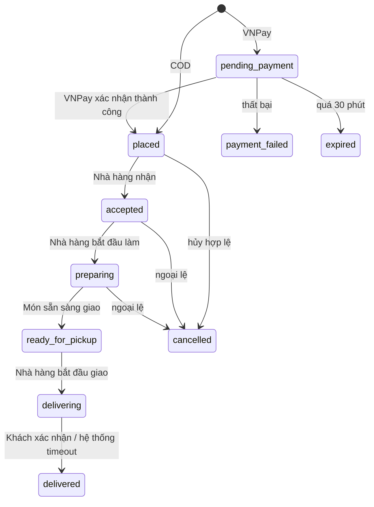

# Phân tích Use Case NomNom — ba vai trò

## 1. Tác nhân

| Mã | Tác nhân | Trách nhiệm |
|---|---|---|
| A1 | Khách hàng | Đặt món, thanh toán, theo dõi, xác nhận nhận hàng, đánh giá |
| A2 | Nhà hàng | Quản lý quán/món, xử lý đơn và tổ chức giao hàng |
| A3 | Admin | Phê duyệt, giám sát, xử lý ngoại lệ và đối soát |
| X1 | VNPay | Xử lý thanh toán/refund online sandbox |
| X2 | Cloudinary/SMTP | Lưu ảnh và gửi OTP email |

## 2. Use case Khách hàng

| Mã | Use case | Điều kiện/kết quả chính |
|---|---|---|
| C01 | Đăng ký/đăng nhập | OTP email; JWT access + refresh rotation |
| C02 | Khám phá và tìm kiếm | Chỉ hiển thị quán/món đang hoạt động |
| C03 | Quản lý giỏ | Một giỏ active cho một quán; giá được kiểm tra lại khi checkout |
| C04 | Quản lý địa chỉ | Chỉ đọc/sửa/xóa địa chỉ thuộc tài khoản |
| C05 | Áp voucher | Kiểm tra phạm vi, thời gian, quota, min-order và per-user limit |
| C06 | Đặt đơn COD/VNPay | Customer-only; transaction + idempotency; tổng tiền do server tính |
| C07 | Theo dõi đơn | Xem timeline và thông báo theo trạng thái đã commit |
| C08 | Hủy đơn | Chỉ ở mốc cho phép; refund là quy trình riêng |
| C09 | Xác nhận đã nhận | Chỉ chủ đơn, từ `delivering` sang `delivered` |
| C10 | Chat/đánh giá | Chỉ các bên thuộc đơn; đánh giá món/quán sau giao |

## 3. Use case Nhà hàng

| Mã | Use case | Điều kiện/kết quả chính |
|---|---|---|
| M01 | Nộp hồ sơ quán | Admin duyệt trước khi hoạt động |
| M02 | Quản lý hồ sơ/giờ mở | Thay đổi nhạy cảm đi qua quy trình duyệt |
| M03 | Quản lý danh mục/món | Giá, tồn kho, trạng thái và ảnh |
| M04 | Nhận đơn | `placed -> accepted`; chỉ đơn thuộc quán |
| M05 | Chuẩn bị đơn | `accepted -> preparing -> ready_for_pickup` |
| M06 | Bắt đầu giao | `ready_for_pickup -> delivering`; nhà hàng tự giao/thuê ngoài |
| M07 | Quản lý voucher/review/chat | Chỉ tài nguyên thuộc quán |
| M08 | Xem ví và yêu cầu rút | Không vượt số dư khả dụng; Admin duyệt payout |

## 4. Use case Admin

| Mã | Use case | Điều kiện/kết quả chính |
|---|---|---|
| A01 | Dashboard vận hành | KPI đơn, GMV, nhà hàng, tài khoản |
| A02 | Duyệt/từ chối nhà hàng | Ghi lý do, notification và audit log |
| A03 | Quản lý tài khoản | Khóa/mở có lý do và audit |
| A04 | Tra cứu/override đơn | Chỉ ngoại lệ hợp lệ; không thay nghiệp vụ nhà hàng thường ngày |
| A05 | Hủy/refund | Tách trạng thái đơn và tiền; kết quả gateway là nguồn xác nhận |
| A06 | Đối soát/payout | Kiểm tra số dư, chuyển trạng thái idempotent, lưu external reference |
| A07 | Voucher/cấu hình/nội dung | Validate kiểu, phạm vi và giới hạn trước khi lưu |
| A08 | Kiểm duyệt review/hỗ trợ | Ẩn/khôi phục có audit; chat theo ngữ cảnh |

## 5. State machine đơn hàng

Mọi transition phải kiểm tra role, quyền sở hữu, trạng thái nguồn và thực hiện trong transaction.
Admin override cần lý do và audit. Trạng thái `picked_up` chỉ được đọc để tương thích dữ liệu cũ.

## 6. Ma trận hủy và hoàn tiền

| Trạng thái | COD chưa thu | VNPay đã trả |
|---|---|---|
| `pending_payment` | Không áp dụng | Hết hạn -> `expired`, không refund vì chưa trả thành công |
| `placed` | Có thể hủy theo chính sách | Hủy đơn; refund phải qua gateway/admin, không tự ghi `refunded` |
| `accepted/preparing` | Chỉ ngoại lệ | Chỉ Admin xử lý ngoại lệ và refund có audit |
| `delivering/delivered` | Không hủy tự do | Khiếu nại/đối soát riêng, không đổi trạng thái tùy tiện |

## 7. Luồng demo chuẩn

1. Admin duyệt nhà hàng.
2. Khách chọn món, áp voucher, đặt COD hoặc VNPay.
3. Nhà hàng nhận, chuẩn bị, đánh dấu sẵn sàng và bắt đầu giao.
4. Khách theo dõi, chat, xác nhận nhận món và đánh giá.
5. Nhà hàng xem doanh thu; Admin xem audit/đối soát/payout.
