# NomNom — Phân tích Mô hình Thực thể Liên kết (ERD)

> Tài liệu này mô tả toàn bộ cấu trúc cơ sở dữ liệu của nền tảng giao đồ ăn **NomNom** (xem `database.sql`), giải thích từng bảng, từng cột và mối quan hệ giữa các thực thể, kèm sơ đồ ERD tổng thể bằng Mermaid và hướng dẫn vẽ lại sơ đồ trên **diagrams.net (draw.io)** sử dụng ký hiệu **Crow's Foot** cho báo cáo tốt nghiệp.

---

## 1. Tổng quan kiến trúc dữ liệu

NomNom là nền tảng giao đồ ăn đa vai trò gồm 4 module: **Customer**, **Merchant**, **Driver**, **Admin**. Lược đồ CSDL được thiết kế theo nguyên tắc **monolithic relational** — một cơ sở dữ liệu quan hệ duy nhất, dễ triển khai, dễ vận hành, vẫn đảm bảo khả năng mở rộng về sau.

Toàn bộ schema gồm **24 bảng**, được tổ chức thành **8 nhóm chức năng** để team dễ phân chia công việc:

| # | Nhóm chức năng | Số bảng | Bảng |
|---|---|---|---|
| 1 | Định danh & Xác thực | 4 | `users`, `user_roles`, `otp_codes`, `refresh_tokens` |
| 2 | Khách hàng & Địa chỉ | 2 | `customer_profiles`, `customer_addresses` |
| 3 | Nhà hàng & Thực đơn | 4 | `cuisines`, `restaurants`, `menu_categories`, `menu_items` |
| 4 | Giỏ hàng | 2 | `carts`, `cart_items` |
| 5 | Tài xế | 1 | `driver_profiles` |
| 6 | Đơn hàng & Dispatch | 5 | `orders`, `order_items`, `order_status_logs`, `payments`, `driver_assignments` |
| 7 | Tài chính (Ví) | 3 | `wallets`, `wallet_transactions`, `payout_requests` |
| 8 | Đánh giá, Thông báo, Cấu hình | 3 | `reviews`, `notifications`, `platform_config` |

Mỗi nhóm có thể giao cho một thành viên trong nhóm 6 người làm chủ chính, nhưng tất cả đều quy về một schema duy nhất.

---

## 2. Quy ước thiết kế chung

- **Khoá chính**: `BIGINT UNSIGNED AUTO_INCREMENT` cho hầu hết các bảng; `SMALLINT` cho bảng tham chiếu nhỏ (`cuisines`).
- **Tiền tệ**: lưu dưới dạng `BIGINT` (số nguyên VND, không phần thập phân) — tránh lỗi làm tròn của `FLOAT/DOUBLE`.
- **Thời gian**: cột `created_at` mặc định `CURRENT_TIMESTAMP`, cột `updated_at` tự cập nhật khi có chỉnh sửa.
- **Trạng thái (Status)**: dùng `ENUM` cho mọi tập trạng thái hữu hạn (status đơn hàng, vai trò người dùng, kiểu thanh toán...) — đảm bảo tính toàn vẹn dữ liệu.
- **Khoá ngoại**: tất cả FK đều có chiến lược `ON DELETE` rõ ràng:
  - `CASCADE` cho dữ liệu phụ thuộc tuyệt đối (`cart_items` thuộc `carts`).
  - `RESTRICT` cho các bảng tài chính (`orders`, `wallets`, `payout_requests`) để ngăn xoá nhầm dữ liệu lịch sử.
  - `SET NULL` cho liên kết "tham chiếu mềm" (tài xế bị xoá nhưng đơn cũ vẫn còn).
- **Snapshot dữ liệu**: bảng `orders` lưu snapshot địa chỉ giao; bảng `order_items` lưu snapshot tên + giá. Đây là mấu chốt giúp dữ liệu lịch sử bất biến khi merchant chỉnh thực đơn về sau.

---

## 3. Chi tiết các bảng

### 3.1. Nhóm Định danh & Xác thực

#### Bảng `users`
Bảng trung tâm chứa **mọi tác nhân con người** (khách, chủ nhà hàng, tài xế, quản trị viên).

| Cột | Kiểu | Mô tả |
|---|---|---|
| `id` | BIGINT PK | Khoá chính |
| `email`, `phone` | VARCHAR UNIQUE | Đăng nhập bằng email hoặc SĐT |
| `password_hash` | VARCHAR(255) | Mật khẩu đã mã hoá (bcrypt/argon2) |
| `full_name`, `avatar_url` | — | Thông tin cá nhân |
| `primary_role` | ENUM | Vai trò chính: `customer`/`merchant`/`driver`/`admin` |
| `status` | ENUM | `pending`/`active`/`suspended`/`banned` |
| `email_verified_at`, `phone_verified_at`, `last_login_at` | DATETIME | Mốc thời gian xác thực |

**Mục đích**: là điểm nối duy nhất cho mọi vai trò — cho phép một người vừa là khách hàng vừa là tài xế.

#### Bảng `user_roles`
Bảng phụ M:N giữa user và vai trò. Một user có thể có nhiều vai trò cùng lúc.

#### Bảng `otp_codes`
Lưu mã OTP (đã hash) cho các luồng: đăng ký, đăng nhập, đặt lại mật khẩu. Có `attempts`, `expires_at`, `consumed_at` để chống brute-force.

#### Bảng `refresh_tokens`
Quản lý refresh token cho cơ chế JWT rotation. Mỗi token gắn với `user_agent` + `ip_address` để có thể "đăng xuất tất cả thiết bị".

---

### 3.2. Nhóm Khách hàng & Địa chỉ

#### Bảng `customer_profiles` (1:1 với `users`)
Mở rộng thông tin khách hàng: địa chỉ mặc định, tuỳ chọn ngôn ngữ, tuỳ chọn nhận thông báo marketing.

#### Bảng `customer_addresses` (1:N với `users`)
Mỗi khách có thể lưu nhiều địa chỉ giao hàng (Nhà, Công ty, Bạn bè...). Lưu chi tiết theo cấu trúc địa lý Việt Nam: `line1`, `ward` (phường/xã), `district` (quận/huyện), `city` (tỉnh/TP). Có `latitude`/`longitude` để tính khoảng cách.

---

### 3.3. Nhóm Nhà hàng & Thực đơn

#### Bảng `cuisines`
Danh mục ẩm thực gốc (Ý, Mỹ, Nhật, Lành mạnh, Mexico, Cà phê, Tiệm bánh).

#### Bảng `restaurants`
Thực thể nhà hàng. Các điểm đáng chú ý:
- `owner_user_id` → trỏ về `users`: cho phép một chủ sở hữu vận hành nhiều nhà hàng (chuỗi).
- `business_license_url`, `food_safety_cert_url`: URL ảnh giấy phép kinh doanh và chứng nhận VSATTP (admin xem trực tiếp khi duyệt).
- `commission_rate`: % hoa hồng nền tảng giữ lại (mặc định 15%).
- `status`: workflow duyệt: `pending` → `active`/`rejected`/`suspended`.
- `approved_by_admin_id`: vết kiểm toán ai đã duyệt.
- `is_open_now`: chủ nhà hàng có thể tạm đóng cửa thủ công.

#### Bảng `menu_categories` (1:N với `restaurants`)
Phân loại món trong thực đơn của một nhà hàng (Cổ điển, Đặc sản, Tráng miệng…). Hỗ trợ `sort_order` để chủ nhà hàng tự sắp xếp.

#### Bảng `menu_items` (N:1 với `menu_categories`)
Món ăn cụ thể với:
- `price`: giá VND.
- `prep_time_min`: dùng để tính ETA.
- `in_stock`, `is_featured`, `total_sold`, `rating_avg`.
- `status`: `active`/`hidden`.

---

### 3.4. Nhóm Giỏ hàng

#### Bảng `carts` & `cart_items`
- Một khách có **một giỏ hàng đang hoạt động duy nhất cho mỗi nhà hàng** (UNIQUE constraint trên `customer_id` + `restaurant_id` + `status='active'`).
- `unit_price` được snapshot khi thêm vào giỏ để tránh nhảy giá.
- Khi khách chuyển sang nhà hàng khác, UI hỏi xác nhận để xoá giỏ cũ.

---

### 3.5. Nhóm Tài xế

#### Bảng `driver_profiles` (1:1 với `users`)
Hồ sơ tài xế đầy đủ:
- **Định danh**: CCCD (`national_id`), GPLX (`driver_license_no`), biển số (`license_plate`).
- **Tài liệu KYC**: `id_card_url`, `driver_license_url`, `portrait_url` — admin xem trực tiếp.
- **Ngân hàng nhận lương**: `bank_account_no`, `bank_name`, `bank_account_holder`.
- **Vận hành**: `is_online`, `current_lat`, `current_lng`, `last_location_at` — phục vụ dispatch và màn Tracking của khách (frontend gọi API định kỳ để đọc vị trí mới nhất).
- **Thống kê**: `rating_avg`, `total_trips`.

---

### 3.6. Nhóm Đơn hàng & Dispatch

Đây là **trục xương sống** của toàn hệ thống.

#### Bảng `orders`
Mỗi đơn hàng là một dòng. Các điểm thiết kế quan trọng:
- **Snapshot địa chỉ**: `delivery_address_snapshot`, `pickup_lat/lng`, `delivery_lat/lng` được sao chép vào đơn để không bị ảnh hưởng nếu khách sửa địa chỉ sau này.
- **Phân tách tài chính**: `subtotal`, `delivery_fee`, `discount_amount`, `total_amount`.
- **Phân chia thu nhập**: `driver_earning`, `merchant_earning`, `platform_fee` được tính sẵn để báo cáo nhanh.
- **Vòng đời 10 trạng thái**:
  ```
  pending_payment → placed → accepted → preparing → ready_for_pickup
                  → picked_up → delivering → delivered
  (nhánh phụ: cancelled, failed)
  ```
- **Phương thức thanh toán**: `cod` (tiền mặt) hoặc `vnpay` (cổng VNPay).
- **Hủy đơn**: ghi rõ `cancelled_by_role` và `cancel_reason`.

#### Bảng `order_items`
Chi tiết đơn hàng (1:N với `orders`). Mọi cột "snapshot" đảm bảo dữ liệu lịch sử bất biến.

#### Bảng `order_status_logs` — Sổ ghi trạng thái
Append-only, ghi mỗi lần đổi trạng thái: `from_status` → `to_status`, ai đổi, ghi chú.
- **Nguồn dữ liệu** cho timeline trên màn `Tracking` của khách.
- **Bằng chứng** trong tranh chấp: chứng minh tài xế đã đổi sang `picked_up` lúc 14:32.

#### Bảng `payments`
Mỗi lần thử thanh toán là một dòng (cho phép retry sau khi `failed`). Có `gateway`, `gateway_txn_id`, `raw_response` (JSON) để đối soát với cổng VNPay.

#### Bảng `driver_assignments`
**Cách dispatch hoạt động**: khi đơn chuyển sang `ready_for_pickup`, API `GET /driver/jobs` trả đơn này cho mọi tài xế đang online cùng thành phố. Tài xế nào nhận trước (`POST /jobs/:id/accept`) sẽ được khoá thông qua **UNIQUE constraint trên `order_id`** — insert lần thứ hai sẽ fail, ngăn race condition.

Bảng ghi nhận:
- Mốc đến điểm lấy, đã lấy hàng, đến điểm giao, đã giao.
- `proof_photo_url`: ảnh xác nhận giao hàng.
- `earning_amount`: số tiền tài xế nhận được.

---

### 3.7. Nhóm Tài chính (Ví)

#### Bảng `wallets`
Ví điện tử nội bộ. Một user có thể có ví theo `owner_type` (`driver` hoặc `merchant`) — cùng một bảng tái sử dụng cho cả hai vai trò.

| Cột | Mục đích |
|---|---|
| `balance` | Số dư khả dụng |
| `pending_balance` | Tiền đang chờ giải ngân |
| `total_earned` / `total_withdrawn` | Tổng tích luỹ cho báo cáo |
| `is_locked` | Khoá ví khi có tranh chấp |

#### Bảng `wallet_transactions` — Sổ cái (ledger)
Quan trọng nhất trong nhóm tài chính. **Append-only**: mỗi credit/debit đều có một dòng.
- `direction`: `credit`/`debit`.
- `tx_type` 5 loại:
  - `order_earning` — driver/merchant nhận tiền khi đơn `delivered`.
  - `commission` — nền tảng giữ hoa hồng (debit ví merchant).
  - `order_payment` — COD: tài xế thu hộ → debit ví tài xế (do tài xế "nợ" nền tảng phần phải nộp về).
  - `withdrawal` — rút về ngân hàng.
  - `adjustment` — admin điều chỉnh thủ công.
- `balance_after`: số dư ngay sau giao dịch — cho phép kiểm tra tính toàn vẹn lịch sử.
- `reference_type` + `reference_id`: trỏ về thực thể nguồn (đơn nào, payout nào).

> ⚠️ **Quy tắc cứng**: mọi credit/debit phải đi qua hàm `walletService.applyTx(...)`. Hàm này INSERT vào `wallet_transactions` và UPDATE `wallets.balance` trong **cùng một transaction**. Không service nào được phép `UPDATE wallets SET balance = ...` trực tiếp.

#### Bảng `payout_requests`
Yêu cầu rút tiền về ngân hàng (driver/merchant). Workflow: `pending` → `approved` → `completed`/`rejected`. Cột `external_ref` lưu mã giao dịch ngân hàng do admin nhập sau khi chuyển khoản.

---

### 3.8. Nhóm Đánh giá, Thông báo, Cấu hình

#### Bảng `reviews`
Mỗi đơn có một đánh giá nhà hàng (UNIQUE trên `order_id`). Có `rating` 1–5 sao (kiểm tra bằng CHECK constraint), `comment`, và cột `reply_text` để chủ nhà hàng phản hồi.

#### Bảng `notifications`
Thông báo trong ứng dụng với `type` ENUM (order_placed, order_accepted, payout_status, kyc_status, ...). Frontend gọi `GET /notifications/me` định kỳ để cập nhật danh sách.

#### Bảng `platform_config`
Bảng key-value cho các tham số toàn hệ thống:
- `default_commission_rate` — hoa hồng mặc định.
- `default_driver_share` — % tài xế nhận trên phí giao.
- `min_payout_amount` — số tiền rút tối thiểu.
- `order_auto_cancel_minutes` — phút tự huỷ nếu nhà hàng không xác nhận.
- `max_search_radius_km` — bán kính tìm kiếm tối đa.

---

## 4. Bản đồ quan hệ chính

### 4.1. Một-tới-Một (1:1)

| Bảng A | Bảng B | Ý nghĩa |
|---|---|---|
| `users` | `customer_profiles` | Mở rộng thông tin khách |
| `users` | `driver_profiles` | Mở rộng thông tin tài xế |
| `orders` | `driver_assignments` | Mỗi đơn có tối đa 1 phân công tài xế |
| `orders` | `reviews` | Mỗi đơn 1 đánh giá nhà hàng |

### 4.2. Một-tới-Nhiều (1:N)

| Bảng cha | Bảng con | Ý nghĩa |
|---|---|---|
| `users` (khách) | `customer_addresses` | Một khách có nhiều địa chỉ |
| `users` (chủ) | `restaurants` | Một chủ vận hành nhiều nhà hàng |
| `cuisines` | `restaurants` | Một loại ẩm thực có nhiều nhà hàng |
| `restaurants` | `menu_categories` | Một nhà hàng nhiều danh mục |
| `menu_categories` | `menu_items` | Một danh mục nhiều món |
| `users` (khách) | `carts` | Một khách nhiều giỏ (theo nhà hàng) |
| `carts` | `cart_items` | Một giỏ nhiều dòng |
| `users` (khách) | `orders` | Một khách nhiều đơn |
| `restaurants` | `orders` | Một nhà hàng nhiều đơn |
| `users` (driver) | `orders` | Một tài xế nhiều đơn |
| `customer_addresses` | `orders` | Một địa chỉ nhiều đơn |
| `orders` | `order_items` | Một đơn nhiều dòng |
| `orders` | `order_status_logs` | Một đơn nhiều log trạng thái |
| `orders` | `payments` | Một đơn có thể có nhiều lần thử thanh toán |
| `wallets` | `wallet_transactions` | Một ví nhiều giao dịch |
| `users` | `payout_requests` | Một user nhiều yêu cầu rút |
| `restaurants` | `reviews` | Một nhà hàng nhiều đánh giá |
| `users` | `notifications` | Một user nhiều thông báo |

### 4.3. Nhiều-tới-Nhiều (M:N)

| Bảng A | Bảng trung gian | Bảng B |
|---|---|---|
| `users` | `user_roles` | (vai trò ENUM) |

---

## 5. Sơ đồ ERD tổng thể

Sơ đồ dưới đây sử dụng cú pháp **Mermaid `erDiagram`** — được render tự động trên GitHub, GitLab, VS Code (cài extension *Markdown Preview Mermaid Support*) và Typora. Mọi quan hệ tuân thủ ký hiệu **Crow's Foot**:

| Ký hiệu Mermaid | Ý nghĩa |
|---|---|
| `\|\|--\|\|` | One and only one — One and only one (1:1 bắt buộc cả hai phía) |
| `\|\|--o\|` | One — Zero or one (1:1, phía con tuỳ chọn) |
| `\|\|--o{` | One — Zero or many (1:N, phía con tuỳ chọn) |
| `\|\|--\|{` | One — One or many (1:N, phía con bắt buộc tối thiểu 1) |
| `}o--o{` | Zero-or-many — Zero-or-many (M:N) |

```mermaid
erDiagram
    %% ============================================================
    %%  NomNom — Sơ đồ ERD tổng thể (24 bảng / 8 nhóm chức năng)
    %% ============================================================

    users {
        bigint id PK
        varchar email UK
        varchar phone UK
        varchar password_hash
        varchar full_name
        enum primary_role
        enum status
    }

    user_roles {
        bigint user_id PK
        enum role PK
        datetime granted_at
    }

    otp_codes {
        bigint id PK
        bigint user_id FK
        varchar destination
        enum channel
        enum purpose
        varchar code_hash
        datetime expires_at
    }

    refresh_tokens {
        bigint id PK
        bigint user_id FK
        varchar token_hash UK
        datetime expires_at
        datetime revoked_at
    }

    customer_profiles {
        bigint user_id PK
        bigint default_address_id FK
        varchar preferred_language
        tinyint marketing_opt_in
    }

    customer_addresses {
        bigint id PK
        bigint customer_id FK
        varchar label
        varchar recipient_name
        varchar line1
        varchar city
        decimal latitude
        decimal longitude
        tinyint is_default
    }

    cuisines {
        smallint id PK
        varchar name UK
        varchar slug UK
    }

    restaurants {
        bigint id PK
        bigint owner_user_id FK
        smallint cuisine_id FK
        varchar name
        varchar slug UK
        varchar business_license_url
        varchar food_safety_cert_url
        bigint base_delivery_fee
        decimal commission_rate
        enum status
        bigint approved_by_admin_id FK
    }

    menu_categories {
        bigint id PK
        bigint restaurant_id FK
        varchar name
        smallint sort_order
        tinyint is_active
    }

    menu_items {
        bigint id PK
        bigint restaurant_id FK
        bigint category_id FK
        varchar name
        bigint price
        smallint prep_time_min
        tinyint in_stock
        enum status
    }

    carts {
        bigint id PK
        bigint customer_id FK
        bigint restaurant_id FK
        enum status
    }

    cart_items {
        bigint id PK
        bigint cart_id FK
        bigint menu_item_id FK
        smallint quantity
        bigint unit_price
        varchar note
    }

    driver_profiles {
        bigint user_id PK
        varchar national_id UK
        enum vehicle_type
        varchar id_card_url
        varchar driver_license_url
        varchar bank_account_no
        enum approval_status
        tinyint is_online
        decimal current_lat
        decimal current_lng
    }

    orders {
        bigint id PK
        varchar order_code UK
        bigint customer_id FK
        bigint restaurant_id FK
        bigint driver_id FK
        bigint delivery_address_id FK
        varchar delivery_address_snapshot
        bigint subtotal
        bigint delivery_fee
        bigint total_amount
        bigint driver_earning
        bigint merchant_earning
        bigint platform_fee
        enum status
        enum payment_status
        enum payment_method
    }

    order_items {
        bigint id PK
        bigint order_id FK
        bigint menu_item_id FK
        varchar item_name_snapshot
        bigint unit_price_snapshot
        smallint quantity
        bigint line_subtotal
    }

    order_status_logs {
        bigint id PK
        bigint order_id FK
        varchar from_status
        varchar to_status
        enum changed_by_role
        bigint changed_by_user_id FK
    }

    payments {
        bigint id PK
        bigint order_id FK
        enum method
        bigint amount
        varchar gateway
        varchar gateway_txn_id
        enum status
        json raw_response
    }

    driver_assignments {
        bigint id PK
        bigint order_id UK
        bigint driver_id FK
        datetime arrived_pickup_at
        datetime picked_up_at
        datetime delivered_at
        enum status
        bigint earning_amount
        varchar proof_photo_url
    }

    wallets {
        bigint id PK
        bigint user_id FK
        enum owner_type
        bigint balance
        bigint pending_balance
        tinyint is_locked
    }

    wallet_transactions {
        bigint id PK
        bigint wallet_id FK
        enum direction
        bigint amount
        bigint balance_after
        enum tx_type
        enum reference_type
        bigint reference_id
        bigint performed_by_user_id FK
    }

    payout_requests {
        bigint id PK
        bigint wallet_id FK
        bigint user_id FK
        bigint amount
        varchar bank_account_no
        enum status
        bigint reviewed_by_admin_id FK
        varchar external_ref
    }

    reviews {
        bigint id PK
        bigint order_id UK
        bigint customer_id FK
        bigint restaurant_id FK
        tinyint rating
        text comment
        text reply_text
    }

    notifications {
        bigint id PK
        bigint user_id FK
        enum type
        varchar title
        varchar body
        tinyint is_read
    }

    platform_config {
        varchar config_key PK
        varchar config_value
        enum data_type
        bigint updated_by_admin_id FK
    }

    %% ============================================================
    %%  RELATIONSHIPS
    %% ============================================================

    %% --- Identity & Access ---
    users ||--o{ user_roles            : "có nhiều vai trò"
    users ||--o{ otp_codes             : "yêu cầu OTP"
    users ||--o{ refresh_tokens        : "có refresh token"

    %% --- Customer profile ---
    users ||--|| customer_profiles     : "là khách hàng"
    users ||--o{ customer_addresses    : "có nhiều địa chỉ"
    customer_profiles |o--o| customer_addresses : "địa chỉ mặc định"

    %% --- Driver profile ---
    users ||--o| driver_profiles       : "là tài xế"

    %% --- Restaurant ownership & catalog ---
    users ||--o{ restaurants           : "sở hữu"
    cuisines ||--o{ restaurants        : "phân loại ẩm thực"
    users ||--o{ restaurants           : "duyệt bởi admin"
    restaurants ||--|{ menu_categories : "có danh mục"
    menu_categories ||--o{ menu_items  : "chứa món"
    restaurants ||--o{ menu_items      : "thuộc về"

    %% --- Cart ---
    users ||--o{ carts                 : "có giỏ hàng"
    restaurants ||--o{ carts           : "giỏ theo nhà hàng"
    carts ||--o{ cart_items            : "chứa món"
    menu_items ||--o{ cart_items       : "được thêm"

    %% --- Order spine ---
    users ||--o{ orders                : "đặt đơn"
    restaurants ||--o{ orders          : "nhận đơn"
    users ||--o{ orders                : "tài xế giao"
    customer_addresses ||--o{ orders   : "địa chỉ giao"
    orders ||--|{ order_items          : "có dòng"
    menu_items ||--o{ order_items      : "được đặt"
    orders ||--o{ order_status_logs    : "lịch sử trạng thái"
    users ||--o{ order_status_logs     : "đổi bởi"
    orders ||--o{ payments             : "lần thử thanh toán"
    orders ||--o| driver_assignments   : "phân công tài xế"
    users ||--o{ driver_assignments    : "tài xế nhận"

    %% --- Wallet & Payout ---
    users ||--o{ wallets               : "sở hữu ví"
    wallets ||--|{ wallet_transactions : "giao dịch ví"
    users ||--o{ wallet_transactions   : "admin điều chỉnh"
    wallets ||--o{ payout_requests     : "yêu cầu rút"
    users ||--o{ payout_requests       : "người yêu cầu"
    users ||--o{ payout_requests       : "admin duyệt"

    %% --- Reviews & Notifications ---
    orders ||--o| reviews              : "có 1 đánh giá"
    users ||--o{ reviews               : "khách viết"
    restaurants ||--o{ reviews         : "nhà hàng nhận"
    users ||--o{ notifications         : "nhận thông báo"

    %% --- Platform config ---
    users ||--o{ platform_config       : "admin cập nhật"
```



> **Cách hiển thị sơ đồ**:
> - **Trên GitHub/GitLab**: tự động render khi mở file `.md`.
> - **Trong VS Code**: cài extension *Markdown Preview Mermaid Support* → bấm `Ctrl+Shift+V`.
> - **Online**: copy đoạn code mermaid vào [https://mermaid.live](https://mermaid.live) để xem và xuất PNG/SVG.

### 5.1. Đọc sơ đồ — 4 cụm trọng tâm

1. **Trục `users`** ở giữa — kết nối với mọi vai trò (customer, merchant, driver, admin) và các bảng phụ thuộc.
2. **Trục `orders`** — xương sống của hệ thống, nối khách + nhà hàng + tài xế + địa chỉ + phương thức thanh toán + đánh giá.
3. **Cụm tài chính** (`wallets`, `wallet_transactions`, `payout_requests`) — tách rời và chỉ liên kết qua `users` để giữ tính toàn vẹn.
4. **Snapshot** — `orders.delivery_address_snapshot`, `order_items.item_name_snapshot`, `order_items.unit_price_snapshot` đảm bảo dữ liệu lịch sử bất biến.

---

## 6. Hướng dẫn vẽ ERD trên diagrams.net

### 6.1. Chuẩn bị

1. Truy cập **[https://app.diagrams.net](https://app.diagrams.net)**.
2. Chọn **Create New Diagram** → đặt tên `nomnom_erd.drawio` → lưu vào Google Drive hoặc tải về máy.
3. Chọn template **Blank Diagram**.
4. Bật shape library **Entity Relation**: menu **More Shapes** ở thanh trái → tích chọn **Entity Relation** (mục Software) → **Apply**. Thư viện này chứa sẵn shape bảng và các đầu nối Crow's Foot.
5. Khổ giấy đề xuất: **A3 ngang** (1684 × 1190 px) — đủ chỗ cho 24 bảng trên một trang.

### 6.2. Bố cục đề xuất

```
┌──────────────────────────────────────────────────────────────────────────┐
│                                                                            │
│   [Định danh]            [Đơn hàng — TRUNG TÂM]            [Nhà hàng]     │
│   users                  orders                            restaurants     │
│   user_roles             order_items                       cuisines        │
│   otp_codes              order_status_logs                 menu_categories │
│   refresh_tokens         payments                          menu_items      │
│                          driver_assignments                                │
│                                                                            │
│   [Khách hàng]           [Tài xế]                  [Tài chính]            │
│   customer_profiles      driver_profiles           wallets                 │
│   customer_addresses                               wallet_transactions     │
│   carts                                            payout_requests         │
│   cart_items                                                               │
│                                                                            │
│          [Hệ thống]                                                        │
│          reviews · notifications · platform_config                         │
│                                                                            │
└──────────────────────────────────────────────────────────────────────────┘
```

- **Đặt `orders` ở giữa** — tất cả các bảng quan trọng đều liên kết với `orders`.
- **Nhóm liên quan đặt gần nhau** để giảm số đường nối cắt nhau.
- Dùng **container Group** (Ctrl + G) để bao quanh từng nhóm — dễ trình bày khi thuyết trình.

### 6.3. Quy ước màu (gợi ý)

- 🔵 Xanh lam — Định danh (`users`, `user_roles`, `otp_codes`, `refresh_tokens`)
- 🟦 Xanh nhạt — Khách hàng (`customer_profiles`, `customer_addresses`, `carts`, `cart_items`)
- 🟧 Cam — Nhà hàng & Thực đơn (`cuisines`, `restaurants`, `menu_categories`, `menu_items`)
- 🟪 Tím — Đơn hàng (`orders`, `order_items`, `order_status_logs`, `payments`, `driver_assignments`)
- 🟩 Xanh lá — Tài xế & Tài chính (`driver_profiles`, `wallets`, `wallet_transactions`, `payout_requests`)
- ⬜ Xám — Hệ thống (`reviews`, `notifications`, `platform_config`)

### 6.4. Vẽ một bảng

1. Trên thanh shape bên trái, kéo shape **"Entity"** (hình chữ nhật có 2 dòng — tiêu đề + danh sách thuộc tính) ra canvas.
2. Đổi tên bảng (ví dụ `orders`).
3. Click vào hàng đầu tiên để thêm cột — gõ tên cột rồi `Tab` để chuyển sang ô kiểu dữ liệu.
4. Đánh dấu khóa: thêm tiền tố:
   - `PK` — Primary Key (in đậm hoặc gạch chân).
   - `FK` — Foreign Key.
   - `UQ` — Unique.
5. Thứ tự cột nên là: PK ở trên cùng → FK → các cột nghiệp vụ → cột audit (`created_at`, `updated_at`) ở cuối.

> **Mẹo**: nếu thấy shape Entity quá đơn giản, dùng **Edit Style** (`Ctrl+E`) và đặt:
> ```
> shape=table;startSize=30;container=1;collapsible=0;childLayout=tableLayout;
> ```
> để có shape "Database Table" chuẩn.

### 6.5. Kết nối Crow's Foot

Trong thư viện **Entity Relation**, có sẵn các đường nối với 4 đầu Crow's Foot:

| Ký hiệu đầu nối | Ý nghĩa |
|---|---|
| `\|\|` (hai gạch song song) | **One and only one** (1, bắt buộc) |
| `\|o` (gạch + vòng) | **Zero or one** (0..1, không bắt buộc) |
| `>\|` (chân quạ + gạch) | **One or many** (1..N, bắt buộc) |
| `>o` (chân quạ + vòng) | **Zero or many** (0..N, không bắt buộc) |

**Cách kéo**:
1. Hover vào cạnh bảng nguồn → 4 mũi tên xanh xuất hiện → click giữ và kéo sang bảng đích.
2. Click chọn đường vừa vẽ → ở panel phải, mục **Style** hoặc **Arrow** chọn `Crow's foot`.
3. Đầu **gần bảng nào thì biểu diễn cardinality của bảng đó**.

**Một số quan hệ tiêu biểu cần vẽ rõ**:

| Từ | Đến | Cardinality | Đầu Crow's Foot |
|---|---|---|---|
| `users (khách)` | `orders` | 1..1 — 0..N | ❘❘ — ⪤ |
| `users (driver)` | `orders` | 0..1 — 0..N | ╞⨁ — ⪤ |
| `restaurants` | `orders` | 1..1 — 0..N | ❘❘ — ⪤ |
| `orders` | `order_items` | 1..1 — 1..N | ❘❘ — ⪤❘ |
| `orders` | `driver_assignments` | 1..1 — 0..1 | ❘❘ — ╞⨁ |
| `orders` | `reviews` | 1..1 — 0..1 | ❘❘ — ╞⨁ |
| `wallets` | `wallet_transactions` | 1..1 — 1..N | ❘❘ — ⪤❘ |
| `users` | `customer_profiles` | 1..1 — 1..1 | ❘❘ — ❘❘ |
| `users` | `driver_profiles` | 1..1 — 0..1 | ❘❘ — ╞⨁ |
| `restaurants` | `menu_categories` | 1..1 — 1..N | ❘❘ — ⪤❘ |
| `menu_categories` | `menu_items` | 1..1 — 0..N | ❘❘ — ⪤ |

### 6.6. Thẩm mỹ & Trình bày báo cáo tốt nghiệp

- **Bố cục lưới**: bật `View > Grid` và canh các bảng theo khoảng cách đều (Ctrl + Shift + H để phân bố ngang).
- **Hạn chế đường cắt nhau**: dùng các điểm uốn (waypoint) — chuột phải đường nối → **Edit Geometry**.
- **Đặt tên đường nối**: bấm đôi chuột vào đường, gõ tên quan hệ ngắn gọn, ví dụ "đặt", "thuộc về", "phân công".
- **Đường nối cong** thay vì gãy khúc trông sạch hơn — chọn đường → **Edge style: Curved**.
- **Phông chữ**: dùng **Arial 11pt** cho cột bảng, **Arial 13pt bold** cho tên bảng.
- **Xuất ảnh**: `File > Export As > PNG/PDF` với độ phân giải 300 DPI để chèn vào báo cáo.

### 6.7. Trình tự vẽ đề xuất (60 phút)

1. (5') Vẽ trục **`users`** ở giữa-trái + các bảng 1:1 (`customer_profiles`, `driver_profiles`).
2. (10') Vẽ cụm **Nhà hàng + Thực đơn** ở phải.
3. (15') Vẽ cụm **Đơn hàng** ở giữa, kết nối với `users`, `restaurants`, `customer_addresses`.
4. (10') Thêm **`order_items`, `order_status_logs`, `payments`, `driver_assignments`**.
5. (10') Vẽ cụm **Ví + Payout**.
6. (5') Vẽ các bảng còn lại: `reviews`, `notifications`, `platform_config`, `carts`, `cart_items`.
7. (5') Tô màu theo nhóm, căn lưới, kiểm tra mọi FK trong `database_mvp.sql` đã có đường nối chưa, xuất PDF.

---

## 7. Phụ lục — Số liệu nhanh

- **Tổng bảng**: 24 bảng (chia thành 8 nhóm chức năng).
- **Khoá ngoại**: ~35 ràng buộc.
- **ENUM nghiệp vụ**: ~15 (status đơn hàng, status ví, loại giao dịch, loại tài liệu KYC...).
- **Các điểm thiết kế đáng chú ý**:
  - Cơ chế **OTP + refresh token** đầy đủ.
  - **Snapshot dữ liệu** cho đơn hàng và mục đơn (bất biến lịch sử).
  - **Sổ cái ví append-only** với 5 loại giao dịch + cột `balance_after` để kiểm tra tính toàn vẹn.
  - **State-machine log** cho đơn hàng (đường dẫn audit).
  - **Dispatch chống race condition** bằng UNIQUE constraint.
  - **Cấu hình hệ thống** linh hoạt qua `platform_config` (hoa hồng, % chia tài xế đều đổi được không cần deploy).
